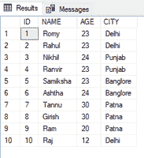
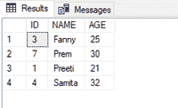
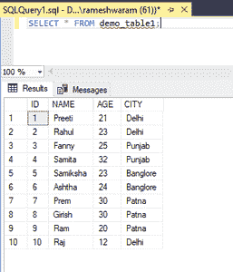

# 基于标识匹配从一个表更新到另一个表的 SQL 查询

> 原文:[https://www . geesforgeks . org/SQL-基于 id 匹配从一个表到另一个表的查询到更新/](https://www.geeksforgeeks.org/sql-query-to-update-from-one-table-to-another-based-on-an-id-match/)

在本文中，我们将看到，如何基于 ID 匹配从一个表更新到另一个表。我们可以使用 SQL 中的 update 语句来更新表。更新语句后面总是跟着 SET 命令。SET 命令用于指定表中哪些列和值需要更新。

**更新语法:**

```sql
UPDATE table_name
SET column_name = value
WHERE condition;
```

为了执行上述功能，我们可以将列名设置为等于另一个表中的数据，并且在 WHERE 子句的条件下，我们可以匹配 ID。

现在，按照以下步骤进行演示:

**步骤 1:** 创建数据库

我们可以使用以下命令创建一个名为 geeks 的数据库。

**查询:**

```sql
CREATE DATABASE geeks;
```

**第二步**:使用数据库

使用下面的 SQL 语句将数据库上下文切换到极客:

**查询:**

```sql
USE geeks;
```

**步骤 3:** 表格定义

在极客的数据库中，我们有两个名为“demo_table1”和“demo_table2”的表。

**查询(demo_table1):**

```sql
CREATE TABLE demo_table1(
ID int,
NAME VARCHAR(20),
AGE INT,
CITY VARCHAR(20) );
```

**查询(demo_table2):**

```sql
CREATE TABLE demo_table2(
ID int,
NAME VARCHAR(20),
AGE int);
```

**步骤 4:** 将数据插入表格

**查询(demo_table1):**

```sql
INSERT INTO demo_table1 VALUES
(1,'Romy',23,'Delhi'),
(2,'Rahul',23,'Delhi'),
(3,'Nikhil',24,'Punjab'),
(4,'Ranvir',23,'Punjab'),
(5,'Samiksha',23,'Banglore'),
(6,'Ashtha',24,'Banglore'),
(7,'Tannu',30,'Patna'),
(8,'Girish',30,'Patna'),
(9,'Ram', 20 , 'Patna'),
(10,'Raj', 12, 'Delhi');
```

**查询(demo_table2):**

```sql
INSERT INTO demo_table2 VALUES
(3,'Fanny',25 ),
(7,'Prem', 30),
(1,'Preeti',21),
(4,'Samita',32);
```

**第五步:**查看内容

执行以下查询查看表格的内容

**查询(demo_table1):**

```sql
SELECT * FROM demo_table1;
```

**输出:**



**查询(demo_table2):**

```sql
SELECT * FROM demo_table2;
```



**步骤 6:** 根据 ID 匹配从 demo_table2 更新 demo_table1 数据

为了演示，根据 ID 匹配更新 demo_table2 中 demo_table1 的所有字段。如果两个表具有相同的列名，我们可以使用语法“ **table_name.column_name** ”编写列名，以避免混淆。

**例如:**

demo_table1 和 demo_table 2 都有 NAME 列。

*   **demo_table1。标识**:指定 demo_table1 的标识列
*   **demo_table2。标识:**指定 demo_table2 的标识列

**查询:**

```sql
UPDATE demo_table1
SET demo_table1.NAME=demo_table2.NAME, 
demo_table1.AGE=demo_table2.AGE
FROM demo_table1, demo_table2
WHERE demo_table1.ID=demo_table2.ID;
```

再次查看 demo_table1 的内容，查看更新后的表格。

**输出:**



我们可以看到内容现在是基于 demo_table2 的 ID 值更新的。