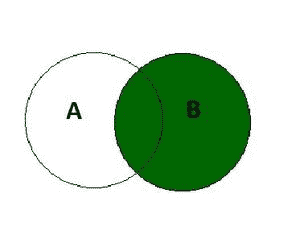

# SQL 右连接

> 原文:[https://www.geeksforgeeks.org/sql-right-join/](https://www.geeksforgeeks.org/sql-right-join/)

SQL 中的 RIGHT JOIN 关键字返回所有**匹配的记录(或行)**和**记录(或行)，它们出现在右表中但不在左表**中。这意味着，如果某一行出现在右表中但不在左表中，结果将包括该行，但在左表的每一列中有一个空值。如果左表中的记录不在右表中，它将不会包含在结果中。



**右连接**

右连接的语法是:-

```
SELECT column_name(s) 
FROM tableA 
RIGHT JOIN tableB ON tableA.column_name = tableB.column_name;
```

**SQL 右连接示例:**

在本例中，我们将考虑两个表格**员工**表格，包含在特定部门工作的员工的详细信息，以及**部门**表格，包含该部门的详细信息

**员工表:**

<figure class="table">

| **【EMP _ no】** | **【EMP _ name】** |

</figure>

**部门表:**

<figure class="table">

|  |

</figure>

**为了对这两个表执行右连接，我们将使用以下 SQL 查询:**

```
select emp_no , emp_name ,d_name, location 
from employee 
right join dept on employee.dept_no = department.dept_no;
```

**我们将得到的输出如下:**

<figure class="table">**T18】IT****T24】E2T26】阿姆里塔·阿格沃尔**

| 电磁脉冲 _ 否 | 电磁脉冲名称 | d _ name | location |
| E1 | Warun Sinhar | Delhi |
| 人力资源 【T29 | examine | Noida |
| 【空】 | 【空】 | marketing | Mathura |

**T65】**</figure>

**因为右连接给出了匹配的行和出现在左表中但不在右表中的行。在本例中，我们看到，在执行正确的联接后，不包含任何员工的部门包含 emp_no 和 emp_name 的[空]值。**