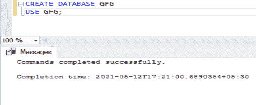
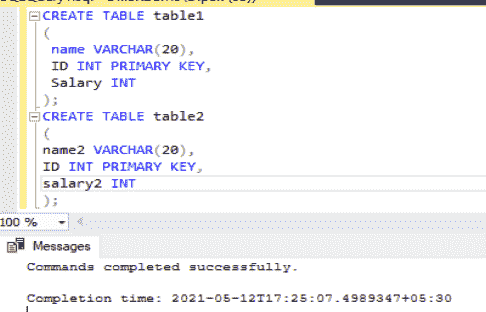
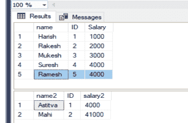
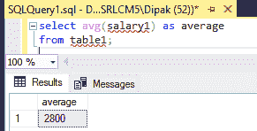
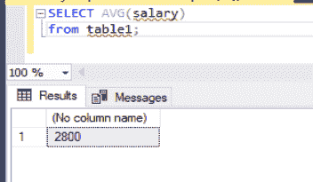
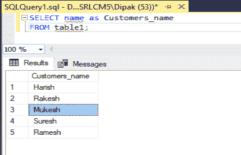
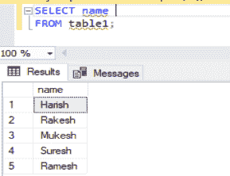

# SQL–选择为

> 原文:[https://www.geeksforgeeks.org/sql-select-as/](https://www.geeksforgeeks.org/sql-select-as/)

在 SQL 中，我们有一些数据库，其中包含有我们的数据所在的表。如果我们想从这个表中选择一些数据，那么我们就使用 select 子句和 from 子句来指定这个表。我们可以使用 WHERE 子句对我们的选择应用一些条件。

现在，在某些情况下，我们可能需要更改所选数据的名称，即列名应该不同于选择表的名称。因此，为了实现这个任务，我们使用 AS 子句和 SELECT 子句来根据需要更改列的名称。

该子句还为聚合函数调用提供了命名工具。假设我们在某个查询中调用了一个聚合函数并选择了该函数，那么我们应该为存储它的列提供一些名称。为此，我们将使用 AS 子句。

让我们首先建立数据库，如下所示:



现在让我们创建一些表，并在其中插入一些数据，如下所示:



创建的表格



表格数据

现在，我们将展示选择 AS 在两种不同情况下的工作方式:

**案例 1:** 当我们需要选择一个聚合函数并为其命名一列时。低于给它的代码。

```sql
SELECT avg(salary1) AS average
FROM table1;
```

该查询的输出如下所示:



我们可以看到如何使用存储聚合函数结果的名称平均值创建一个新列。我们可以用上面创建列的新表名保存这个查询。如果我们在上面的查询中没有使用 AS 子句，那么这将如下所示:



不带 AS 条款

我们可以看到，在上面没有 AS 子句的查询中，选择了 select 子句中提到的默认格式。

**情况 2:** 当我们要选择任意一列并根据需要重命名时。下面给出了一个例子:



如果我们不使用 AS 子句，将会发生以下情况:



因此，我们能够了解与 SELECT 子句一起使用的 AS 子句。我们还可以将其与 FROM 子句一起使用来重命名表。当存在相关的子查询，其中两个相同的表在子查询中相互组合时，就会这样做。