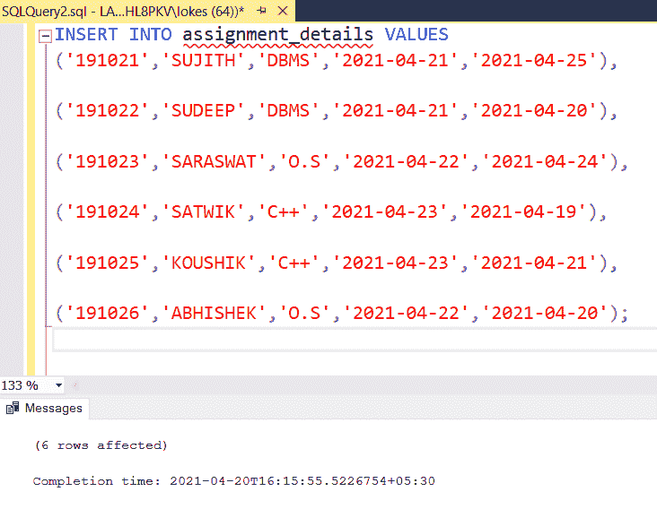

# SQL–选择日期

> 原文:[https://www.geeksforgeeks.org/sql-select-date/](https://www.geeksforgeeks.org/sql-select-date/)

在 Microsoft SQL Server 中， **SELECT DATE** 用于从与日期相关的表中获取数据，日期的默认格式为‘YYYY-MM-DD’。

**语法:**

> 从表名中选择*
> 
> 条件 1，条件 2，..；

现在，我们将逐步详细地对数据库学生执行 SELECT DATE 查询:

**步骤 1:** 创建数据库大学:

```
CREATE DATABASE student;
```

**步骤 2:** 使用数据库学生:

```
USE student;
```

**步骤 3:** 创建包含 5 列的表 assignment_details:

在 MSSQL 中，有接受日期的数据类型 DATE。

```
CREATE TABLE assignment_details
(
    stu_id VARCHAR(20),
    stu_name VARCHAR(20),
    assn_name VARCHAR(20),
    due_date DATE,
    submission_date DATE
);
```


**第 4 步:**在表赋值 _ 明细中添加行:

```
INSERT INTO assignment_details VALUES
('191021','SUJITH','DBMS','2021-04-21','2021-04-25'),
('191022','SUDEEP','DBMS','2021-04-21','2021-04-20'),
('191023','SARASWAT','O.S','2021-04-22','2021-04-24'),
('191024','SATWIK','C++','2021-04-23','2021-04-19'),
('191025','KOUSHIK','C++','2021-04-23','2021-04-21'),
('191026','ABHISHEK','O.S','2021-04-22','2021-04-20');
```



**步骤 5:** 查看表格中的行:

```
SELECT * FROM assignment_details;
```

 

**查询 1:** 显示在‘2021-04-20’提交的学生。

```
SELECT * FROM assignment_details
WHERE submission_date='2021-04-20';
```


**查询 2:** 显示到期日之后提交的学生。

```
SELECT * FROM assignment_details
WHERE due_date<submission_date;
```


**查询 3:** 显示到期日前提交的学生。

```
SELECT * FROM assignment_details
WHERE due_date>=submission_date;
```


**查询 4:** 显示按时提交作业的学生。

```
SELECT stu_id,stu_name,submission_date FROM assignment_details
WHERE assn_name='O.S' AND due_date>=submission_date;
```

