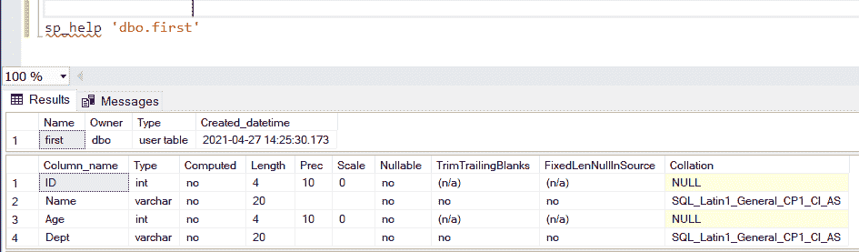
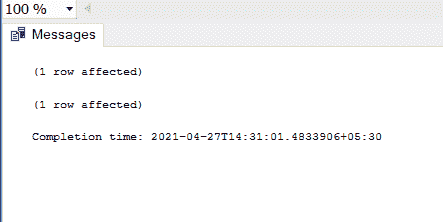
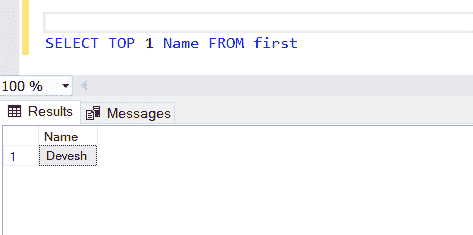

# SQL–首先选择

> 原文:[https://www.geeksforgeeks.org/sql-select-first/](https://www.geeksforgeeks.org/sql-select-first/)

在本文中，我们将研究 SQL 中的 SELECT FIRST 命令，因为我们都知道已经有一个通过“SELECT * FROM Table”从表中选择所有行的命令，但是如果我们想只选择最上面的行，这里 SELECT FIRST 开始发挥作用。这个 FIRST 查询可以用于任何网站中与登录相关的目的，或者如果我们想要建立一个计费系统，我们可以实现它，从最上面的行号开始增加账单号。

**first()函数用于返回任意表的第一行。**

```
Syntax : SELECT FIRST(columnName) FROM tableName
```

因此，我们将从创建一个数据库来执行操作开始。

**步骤 1:** 创建数据库。

```
CREATE DATABASE GFG
```

**步骤 2:** 使用该数据库

```
USE GFG
```

**步骤 3:** 创建表格

```
/****** (1,1) indicates that increment 1 every time insert is performed ******/

CREATE TABLE first 
                  (ID INT PRIMARY KEY IDENTITY (1,1),
                  Name VARCHAR (20) NOT NULL,
                  Age INT NOT NULL,
                  Dept VARCHAR (20) NOT NULL)
```

**步骤 4:** 检查创建的表模式



表的模式

**步骤 4:** 在表中插入数值

```
/****** Insertion queries ******/

INSERT INTO [dbo].[first]
           ([Name]
           ,[Age]
           ,[Dept])
     VALUES
           ('Devesh', 20, 'CSE')
GO

INSERT INTO [dbo].[first]
           ([Name]
           ,[Age]
           ,[Dept])
     VALUES
           ('Aditya', 19, 'BT')
GO

INSERT INTO [dbo].[first]
           ([Name]
           ,[Age]
           ,[Dept])
     VALUES
           ('Megha', 20, 'CSE')
GO
```



**步骤 5:** 使用表中的 first()函数(在 MS ACCESS 中使用 first()。

```
SELECT TOP 1 Name FROM first
```

