# SQL–用 MS SQL Server 从多个表中选择

> 原文:[https://www . geesforgeks . org/SQL-从多个表中选择-带-ms-sql-server/](https://www.geeksforgeeks.org/sql-select-from-multiple-tables-with-ms-sql-server/)

在[**【SQL】**](https://www.geeksforgeeks.org/sql-tutorial/)**中，我们也可以通过对多个表使用 [**【选择】**](https://www.geeksforgeeks.org/sql-select-query/) 来从多个表中检索数据，这实际上导致了所有表的**交叉连接**。从两个的**交叉连接**产生的结果表包含第二个表的所有行组合，第二个表是表的笛卡尔乘积。如果我们考虑表 1 包含 m 行，表 2 包含 n 行，那么选择两个表(即两个表的交叉连接)后得到的表包含 *m*n 行*。**

**让我们看看如何使用 **MSSQL** 服务器选择多个表:** 

### ****创建数据库:****

**使用如下 SQL 查询创建数据库极客。**

```sql
**CREATE DATABASE** GeeksForGeeks;
```

**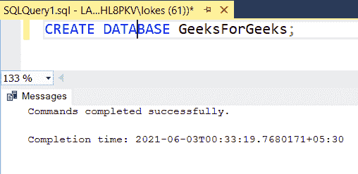**

### ****使用数据库:****

**使用数据库学生使用如下 SQL 查询。**

```sql
**USE** GeeksForGeeks;
```

**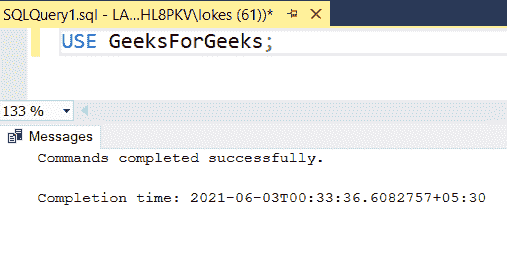**

### ****创建表格:****

**创建三张表学生，*分行 _ 明细*，*信用 _ 明细*用 SQL 查询如下:**

```sql
**CREATE TABLE** student
(  
stu_id **varchar**(10),
stu_name **varchar**(20),
branch **varchar**(20)
);
```

**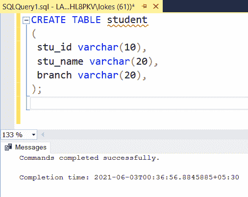**

```sql
**CREATE TABLE** branch_details
(  
branch_name **varchar**(10),
subjects **INT**
);
```

**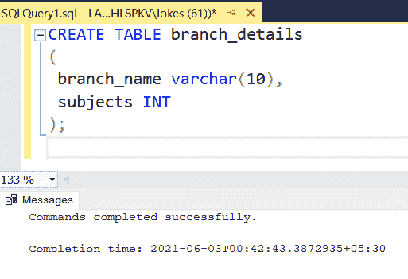**

```sql
**CREATE TABLE** credit_details
(  
branch **varchar**(20), 
max_credits **INT,**
min_credits_required **INT**
);
```

**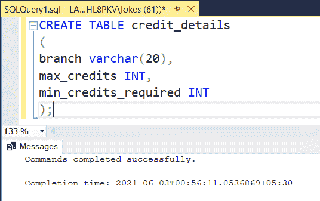**

### ****验证数据库:****

**要查看数据库 GeeksForGeeks 中三个表的描述，请使用如下 SQL 查询。**

```sql
**EXEC** sp_columns student;
**EXEC** sp_columns branch_details;
**EXEC** sp_columns credit_details;
```

**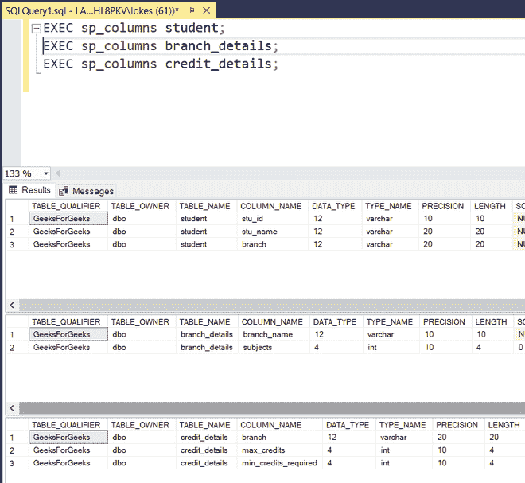**

### ****在三个表中插入数据:****

**使用以下 SQL 查询将行插入表中，如下所示:**

```sql
**INSERT INTO** student **VALUES**
('1901401','DEVA','C.S'),
('1901402','HARSH','C.S'),
('1901403','DAVID','E.C'),
('1901404','GAURAV','E.C');

**INSERT INTO** branch_details **VALUES**
('C.S',8),
('E.C',7),
('M.E',7),
('I.C.E',9),
('E.E.E',8);

**INSERT INTO** credit_details **VALUES**
('C.S',24, 12),
('E.C',21, 11),
('M.E',21, 11),
('I.C.E',27,14),
('E.E.E',24,12);
```

**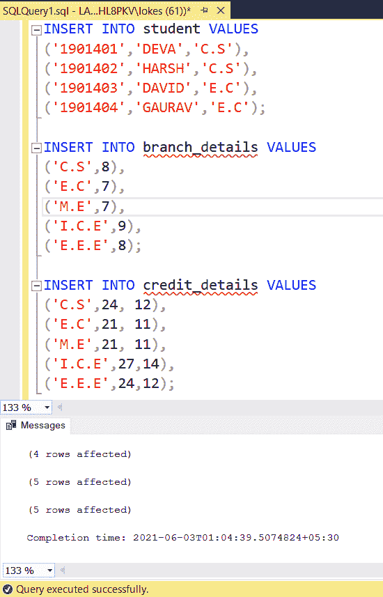**

### ****验证插入的数据:****

**使用如下 SQL 查询在插入行后查看三个表。**

```sql
**SELECT * FROM** student;
**SELECT * FROM** branch_details;
**SELECT * FROM** credit_details;
```

**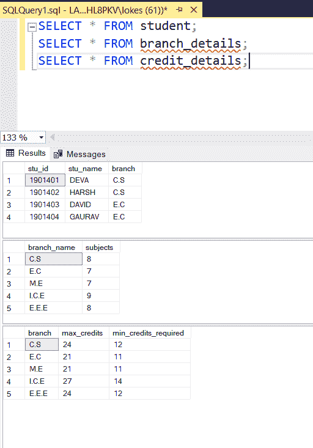**

### ****对 n 个表使用 SELECT 语句:****

```sql
**SYNTAX:**
**SELECT** columns
**FROM** table_1, table_2,...table_n
WHERE condition; 
```

**对两个表使用 SELECT 语句，学生分支详细信息:**

```sql
**SELECT * FROM** student, branch_details;
```

**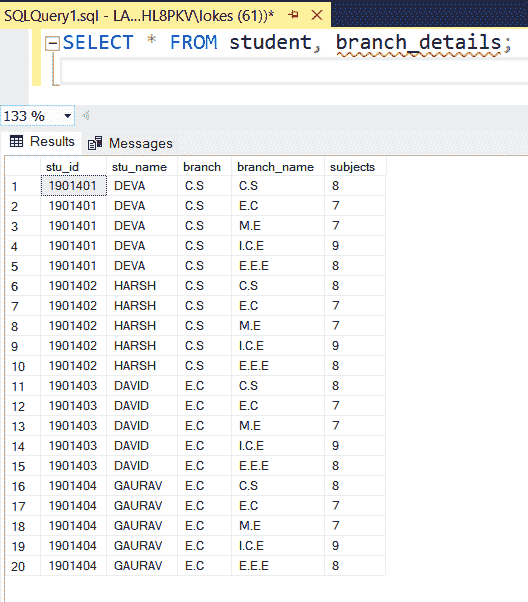**

**该表包含 4*5 = 20 行。**

**对 3 个表使用 SELECT 语句学生、分支机构详细信息、学分详细信息:**

```sql
**SELECT * FROM** student, branch_details, credit_details;
```

**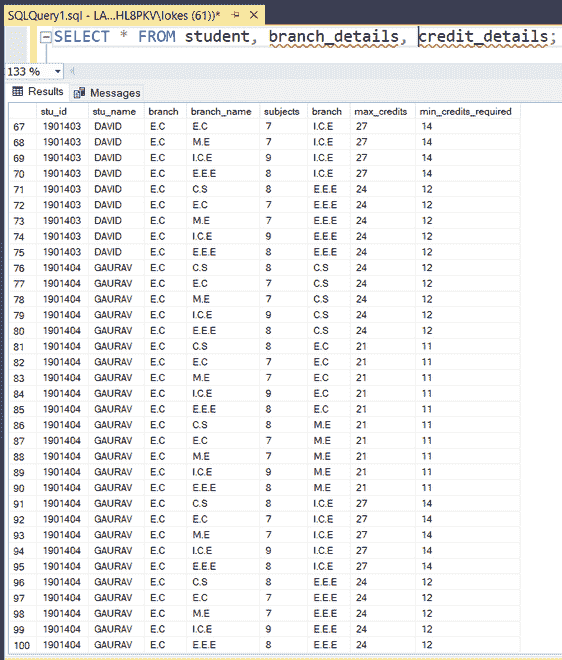**

**生成的表包含 5*4*5 = 100 行。**

**我们可以通过选择多个表并在 **WHERE** 子句中提到适当的条件来获得其他类型的连接，但是使用连接的关键字来添加条件而不是使用具有多个表的 **SELECT** 会更好。**

****示例:****

****查询显示已注册课程的学生及其详细信息。****

```sql
**SELECT** student.stu_id, student.stu_name,
student.branch, subjects, max_credits
**FROM** student, branch_details, credit_details
**WHERE** student.branch = branch_details.branch_name **AND** 
branch_details.branch_name = credit_details.branch;
```

****注意:**当不同的表中有同名的列时，最好使用点运算符来指向特定的表数据。**

**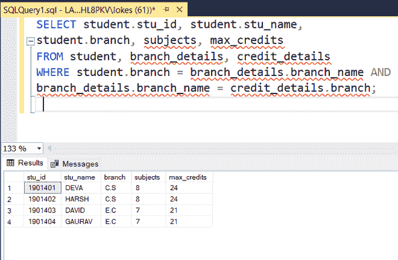**