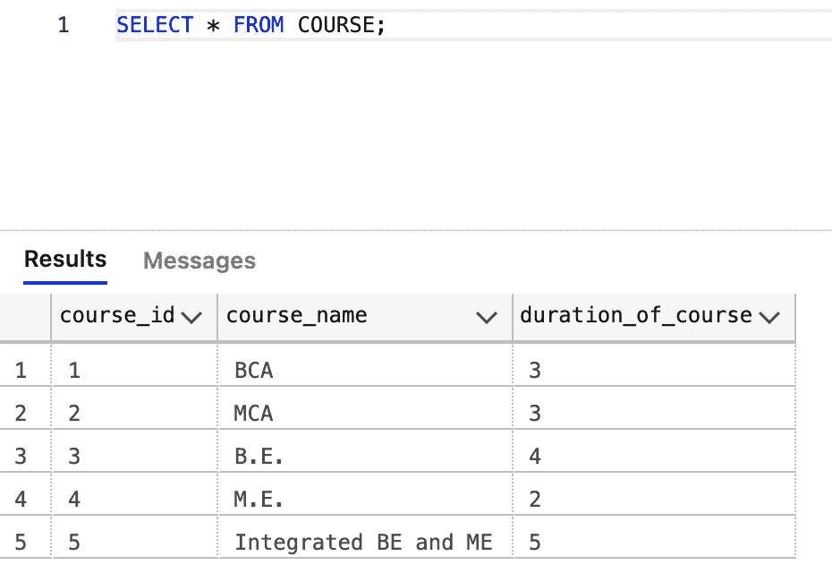

# SQL–选择输入

> 原文:[https://www.geeksforgeeks.org/sql-select-in/](https://www.geeksforgeeks.org/sql-select-in/)

**IN** 运算符是一个成员运算符，它返回与列表或子查询中的值相匹配的值。使用这个运算符，我们可以在 WHERE 子句中指定多个值。该运算符将一个值与一组值进行比较，如果该值属于给定的组，则返回 true，否则返回 false。这是多个*或*条件的简写。

**语法 1(列表):**

> 选择第 1 列，第 2 列…列 n
> 
> 从表名
> 
> WHERE 列名 IN (val-1，val-2，…val-N)；

**语法 2(子查询):**

> 选择第 1 列，第 2 列…列 n
> 
> 从表名 1
> 
> WHERE 列名输入
> 
> (选择列名
> 
> FROM _ name 2 表)；

让我们在微软的 SQL Server 中一步步尝试一下:

**创建数据库:**

使用下面的 SQL 语句创建一个名为 RECORD : 的数据库

```sql
CREATE DATABASE RECORD;
```

**更改为数据库:**

使用下面的 SQL 语句将数据库更改为 RECORD:

```sql
USE RECORD;
```

**创建表格:**

现在，我们在记录数据库中创建一个名为“课程”的表:

```sql
CREATE TABLE COURSE(
course_id INT,
course_name VARCHAR(20),
duration_of_course INT,
PRIMARY KEY(course_id)
); 
```

现在，我们再次在我们的 RECORD 数据库中创建另一个名为 STUDENT 的表:

```sql
CREATE TABLE STUDENT(
roll_no INT,
student_name VARCHAR(20),
course_id INT,
PRIMARY KEY(roll_no)
); 
```

**将数据插入表中:**

使用以下语句，我们将数据插入到“课程”表中:

```sql
INSERT INTO COURSE(course_id, course_name, duration_of_course) VALUES(1, 'BCA', 3);
INSERT INTO COURSE(course_id, course_name, duration_of_course) VALUES(2, 'MCA', 3);
INSERT INTO COURSE(course_id, course_name, duration_of_course) VALUES(3, 'B.E.', 4);
INSERT INTO COURSE(course_id, course_name, duration_of_course) VALUES(4, 'M.E.', 2);
INSERT INTO COURSE(course_id, course_name, duration_of_course) VALUES(5, 'Integrated BE and ME', 5);
```

同样，使用下面的语句，我们将数据插入到 STUDENT 表中:

```sql
INSERT INTO STUDENT(roll_no, student_name, course_id) VALUES(1, 'ANDREW', 1);
INSERT INTO STUDENT(roll_no, student_name, course_id) VALUES(2, 'BOB', 1);
INSERT INTO STUDENT(roll_no, student_name, course_id) VALUES(3, 'CHARLES', 1);
INSERT INTO STUDENT(roll_no, student_name, course_id) VALUES(4, 'DAIZY', 3);
INSERT INTO STUDENT(roll_no, student_name, course_id) VALUES(5, 'EMMANUEL', 2);
INSERT INTO STUDENT(roll_no, student_name, course_id) VALUES(6, 'FAIZAL', 2);
INSERT INTO STUDENT(roll_no, student_name, course_id) VALUES(7, 'GEORGE', 4);
INSERT INTO STUDENT(roll_no, student_name, course_id) VALUES(8, 'HARSH', 5);
INSERT INTO STUDENT(roll_no, student_name, course_id) VALUES(9, 'ISHA', 2);
INSERT INTO STUDENT(roll_no, student_name, course_id) VALUES(10, 'JULIAN', 2);
INSERT INTO STUDENT(roll_no, student_name, course_id) VALUES(11, 'KAILASH', 3);
INSERT INTO STUDENT(roll_no, student_name, course_id) VALUES(12, 'LAIBA', 5);
INSERT INTO STUDENT(roll_no, student_name, course_id) VALUES(13, 'MICHAEL', 3);
```

**显示表格数据:**

现在使用下面的语句，我们显示课程表的内容:

```sql
SELECT * FROM COURSE;
```



再次使用下面的语句，我们显示了 STUDENT 表的内容:

```sql
SELECT * FROM STUDENT;
```


**列表中的条款:**

```sql
SELECT * FROM
STUDENT
WHERE course_id
IN (1, 2, 3);
```


**带子查询的 IN 子句:**

```sql
SELECT * FROM
STUDENT
WHERE course_id
IN (SELECT course_id FROM
COURSE
WHERE duration_of_course = 3);
```

