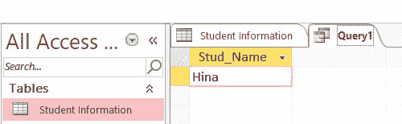
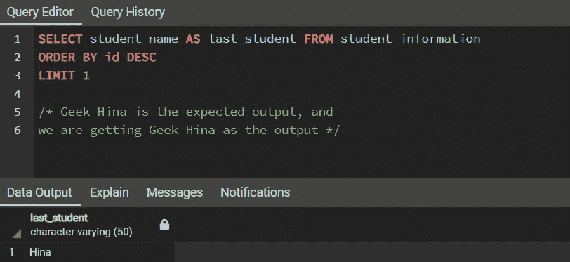
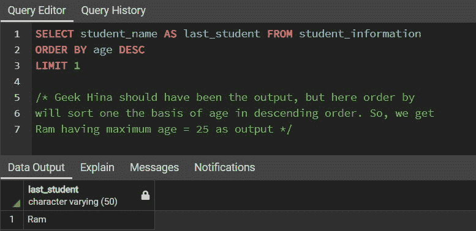
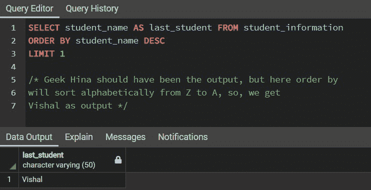
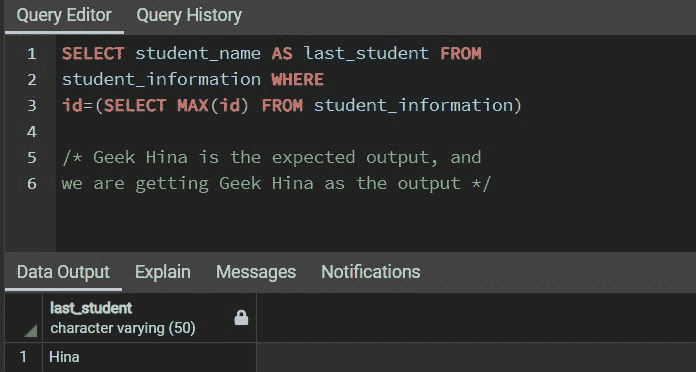
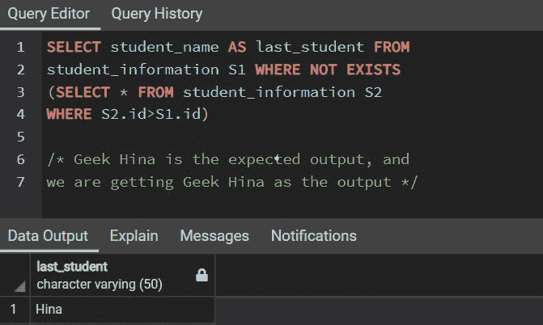

# SQL–选择最后一个

> 原文:[https://www.geeksforgeeks.org/sql-select-last/](https://www.geeksforgeeks.org/sql-select-last/)

**SEQUEL** 广为人知的 SQL ( **结构化查询语言**，是最流行的数据库标准语言。这是一种特定于领域的语言，主要用于执行大量操作，包括创建数据库、以表格形式存储数据、修改、提取等等。有不同版本的 SQL，如 MYSQL、PostgreSQL、Oracle、SQL lite 等。

SQL 在 1986 年成为美国国家标准协会(ANSI) 的规范，第二年在 1987 年成为**国际标准化组织(ISO)的规范。**今天是互联网和科技的世界。我们被大量的数据包围着。因此，为了安全地存储和管理这些数据，我们需要一个合适的数据库，为了管理这个数据库，我们需要一种语言，即 SQL。

在本文中，我们将了解如何获取表中任何记录的最后一个条目。我们将讨论**提取数据库中任何给定表的最后一个条目的四种不同方法**。

**样本输入:**考虑一个“学生信息”表，该表包含了“T2”geekforkeks DSA 课程的注册学生数据。

<figure class="table">

| **学生信息** |
| --- |
| <u>ID</u> | 年龄 | 学生姓名 | 性 |
| --- | --- | --- | --- |
| one | Twenty-two | （英、瑞）哈里（人名） | 男性的 |
| Two | Twenty-three | 他在钓鱼 | 男性的 |
| three | Twenty | 雪球 | 女性的 |
| four | Twenty-five | 随机存取存储器(random access memory 的缩写)ˌ随机访问内存(random-access memory 的缩写) | 男性的 |
| five | Twenty-four | 希娜 | 女性的 |

</figure>

**1。创建数据库**

```
CREATE DATABASE database_name;
```

**2。创建表格**

```
CREATE TABLE Table_name(
col_1 TYPE col_1_constraint,
col_2 TYPE col_2 constraint
.....
);

col: Column name
TYPE: Data type whether an integer, variable character, etc.
col_constraint: Constraints in SQL like PRIMARY KEY, NOT NULL, UNIQUE, REFERENCES, etc.
```

**3。插入表格**

```
INSERT INTO Table_name
VALUES(val_1, val_2, val_3, ..........);

val: Values in particular column.
```

**4。查看表格**

```
SELECT * FROM Table_name
```

### **方法 1:使用 MS 访问**

我们可以使用命令 FIRST()提取特定列的第一个条目，使用 LAST()提取表中特定列的最后一个条目。如需了解更多信息，请访问**中的 [**第一个()和最后一个()功能。**](https://www.geeksforgeeks.org/first-and-lastfunction-in-ms-access/)**

**基本语法:**

```
LAST(expression)
```

例如，假设我们想从“学生信息”表中提取最后一个学生姓名

```
SELECT LAST(Student_name) AS Stud_Name 
FROM StudentInformation;
```

**输出:**



**学生姓氏**

我们可以看到，最后一个学生名字“Hina”是使用上面的查询提取的。但需要注意的是，SELECT LAST 或 LAST(表达式)只在 MS Access 中支持。这个语句不支持 MYSQL、Oracle、PostgreSQL 等。下面讨论了在其他版本的 SQL 中执行上述操作的替代方法，如 MYSQL、Oracle、PostgreSQL 等。

### **方法二:通过整理数据**

我们可以使用 [**ORDER BY**](https://www.geeksforgeeks.org/sql-order-by/) 语句和 [**LIMT**](https://www.geeksforgeeks.org/sql-limit-clause/#:~:text=The%20LIMIT%20clause%20is%20used,be%20a%20non%2Dnegative%20integer.) 子句来提取最后一个数据。基本思想是对表进行降序排序，然后我们将行数限制为 1。这样，我们将获得作为表的最后一行的输出。然后我们可以选择要检索的条目。

**MYSQL 语法:**

```
SELECT col_name(s) FROM Table_Name
ORDER BY appr_col_name DESC
LIMIT 1;

col_name(s): The name of the column(s).
appr_col_name: Appropriate column name to perform ORDER BY.
```

**Oracle 语法:**

```
SELECT col_name(s) FROM Table_Name
ORDER BY appr_col_name DESC
WHERE ROWNUM <= 1;

col_name(s): The name of the column(s).
appr_col_name: Appropriate column name to perform ORDER BY.
```

**输出:**



**学生姓氏**

需要注意的是，为了执行排序，**需要正确选择列**。例如，如果我们选择“ *ORDER BY Student_name DESC* ”，那么它将根据姓名按字母顺序对表格进行排序。因此，包含“Vishal”的行将位于顶部，但包含“Vishal”作为条目的行不是表的最后一行。此外，我们不能使用列“年龄”来执行订单，如下所示:



**拉姆不是最后一个学生名字**



**维沙尔不是最后一个学生名字**

因此，必须使用**列标识**或任何唯一且随表中每条记录顺序递增的列。

### **方法 3:使用子查询和聚合 MAX()**

[**【子查询 T4】**](https://www.geeksforgeeks.org/sql-subquery/) 不过是另一个维护父子关系的查询里面的一个查询。首先执行内部查询，然后执行外部查询。这里，在这个方法中，基本思想是使用聚合函数[**【MAX】**](https://www.geeksforgeeks.org/sql-min-and-max/)获得最大 ID，然后选择与该最大 ID 相关联的学生姓名。这样，我们就可以从表格中提取出最后一个学生的名字。

```
SELECT col_name(s) FROM Table_Name
WHERE appr_col_name = (
        SELECT MAX(appr_col_name)
        FROM Table_Name
);

col_name(s): The name of the column(s).
appr_col_name: Appropriate column name. For example ID.
```

**输出:**



**学生姓氏**

### **方法 4:通过比较或相对方法**

在这个方法中，我们还将使用子查询。基本思想是过滤掉这些行，并检查不存在比我们要提取的行具有更高标识值的行。这将有助于获取具有最大标识的行，因此我们可以检索最后的信息。这是一个复杂的查询，是一种迭代方法，我们将使用 **NOT EXISTS** 语句。如果表中有更多的记录，此方法将需要更多的时间来执行。

```
SELECT col_name(s) FROM Table_Name t1
WHERE NOT EXISTS(
    SELECT * FROM Table_Name t2
    WHERE t2.appr_col_name > t1.appr_col_name
);

col_name(s): The name of the column(s).
appr_col_name: Appropriate column name. For example ID.
```

**输出:**



**学生姓氏**