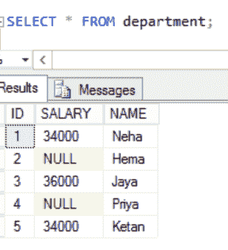
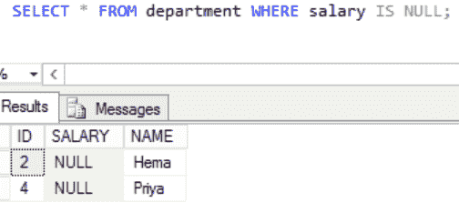
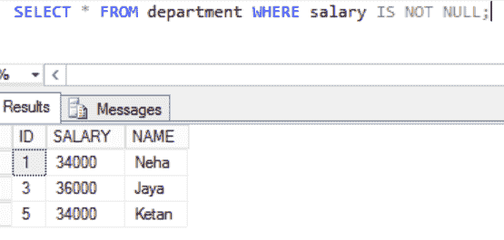

# SQL–选择空值

> 原文:[https://www.geeksforgeeks.org/sql-select-null/](https://www.geeksforgeeks.org/sql-select-null/)

空这个词用来描述 SQL 中缺少的值。在表中，空值是字段中看起来为空的值。具有空值的字段与没有值的字段相同。掌握空值和零值或空格字段之间的区别很重要。

有两种可能:

*   其中，SQL 为空

```sql
Syntax: 
SELECT  *
FROM TABLANAME
WHERE COLUMNNAME IS NULL;
```

*   其中，SQL 不为空

```sql
Syntax:  
SELECT *
FROM TABLANAME
WHERE COLUMNNAME IS NOT NULL;
```

非空表示该列必须始终考虑指定数据类型的显式值。我们没有在两列中使用非空，这意味着这些列可能为空。在记录创建过程中，空值字段为空。

**示例:**

在这里，我们将首先创建一个名为“极客”的数据库，然后在该数据库中创建一个表“部门”。之后，我们将对该表执行查询。

### **创建数据库:**

```sql
CREATE DATABASE geeks;
```

### **使用该数据库:**

```sql
USE geeks;
```

### **在** ***极客*** **数据库中创建**一个**表:**

```sql
CREATE TABLE [dbo].[department](
[ID] [int] NULL,
[SALARY] [int] NULL,
[NAME] [varchar](20) NULL
)
GO
```

### **在表格中添加数值:**

```sql
INSERT INTO [dbo].[department] ( ID, SALARY, NAME) VALUES  ( 1, 34000, 'Neha')  
INSERT INTO [dbo].[department]( ID,  NAME) VALUES  ( 2,  'Hema')
INSERT INTO [dbo].[department]( ID, SALARY, NAME) VALUES  ( 3, 36000, 'Jaya' )
INSERT INTO [dbo].[department] ( ID,  NAME)VALUES  ( 4,  'Priya' )
INSERT INTO [dbo].[department]( ID, SALARY, NAME) VALUES  ( 5, 34000, 'Ketan' ))
GO
```

这是我们表中的数据:

```sql
SELECT * FROM department;
```



**选择 SQL 为空的地方:**

```sql
SELECT * FROM department WHERE salary IS NULL;
```

**输出:**



**选择 SQL 不为空的地方:**

```sql
SELECT * FROM department WHERE salary IS NOT NULL;
```

**输出:**

