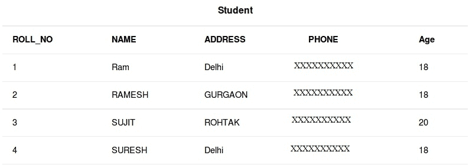

# SQL |选择查询

> 原文:[https://www.geeksforgeeks.org/sql-select-query/](https://www.geeksforgeeks.org/sql-select-query/)

Select 是 SQL 中最常用的语句。SQL 中的 SELECT 语句用于从数据库中检索或获取数据。我们可以获取整个表，也可以根据特定的规则获取。返回的数据存储在结果表中。这个结果表也被称为结果集。

使用 SELECT 命令语句的 SELECT 子句，我们可以指定要在查询结果中显示的列，还可以选择在结果表上方显示哪些列标题。

select 子句是数据库服务器计算的 select 语句的第一个子句，也是最后一个子句之一。这样做的原因是，在我们能够确定最终结果集中包含什么之前，我们需要知道最终结果集中可能包含的所有可能的列。

**样表:**
[](https://media.geeksforgeeks.org/wp-content/cdn-uploads/table.jpg) 
**基本语法:**

```sql
SELECT column1,column2 FROM table_name 
column1 , column2: names of the fields of the table
table_name: from where we want to fetch
```

该查询将返回表中包含字段 column1、column2 的所有行。

*   要获取整个表或表中的所有字段:

    ```sql
     SELECT * FROM table_name;
    ```

*   Query to fetch the fields ROLL_NO, NAME, AGE from the table Student:

    ```sql
    SELECT ROLL_NO, NAME, AGE FROM Student;
    ```

    输出:

    | **滚动 _ 否** | **名称** | **年龄** |
    | --- | --- | --- |
    | one | 随机存取存储器(random access memory 的缩写)ˌ随机访问内存(random-access memory 的缩写) | Eighteen |
    | Two | RAMESH | Eighteen |
    | three | SUJIT | Twenty |
    | four | SURESH | Eighteen |

*   To fetch all the fields from the table Student:

    ```sql
     SELECT * FROM Student;
    ```

    输出:

    | **滚动 _ 否** | **名称** | **地址** | **PHONE** | **年龄** |
    | --- | --- | --- | --- | --- |
    | one | 随机存取存储器(random access memory 的缩写)ˌ随机访问内存(random-access memory 的缩写) | 德里 | XXXXXXXXXX | Eighteen |
    | Two | RAMESH | 古尔冈 | XXXXXXXXXX | Eighteen |
    | three | SUJIT | 罗塔克 | XXXXXXXXXX | Twenty |
    | four | SURESH | 德里 | XXXXXXXXXX | Eighteen |

本文由 [**哈什·阿加瓦尔**](https://www.facebook.com/harsh.agarwal.16752) 供稿。如果你喜欢 GeeksforGeeks 并想投稿，你也可以使用[contribute.geeksforgeeks.org](http://www.contribute.geeksforgeeks.org)写一篇文章或者把你的文章邮寄到 contribute@geeksforgeeks.org。看到你的文章出现在极客博客主页上，帮助其他极客。

如果你发现任何不正确的地方，或者你想分享更多关于上面讨论的话题的信息，请写评论。