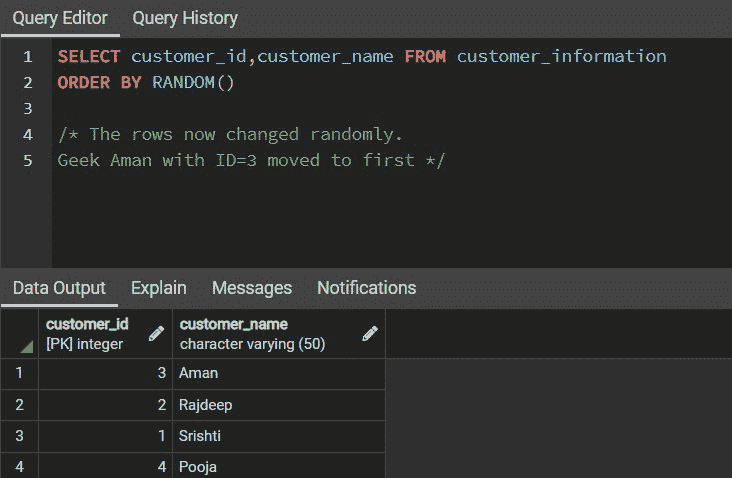

# SQL–随机选择

> 原文:[https://www.geeksforgeeks.org/sql-select-random/](https://www.geeksforgeeks.org/sql-select-random/)

SQL 中的 **RANDOM( )** 通常用于从数据库中存在的表中返回一个随机行。它在现实生活中有很多应用。

例如:

1.  一个组织里有很多员工。假设，如果事件管理器想要邮寄任意十个随机员工，那么他/她可以使用 SQL 中的 random()来获取这十个随机员工的电子邮件 Id。
2.  它还可以用来显示在线考试中的随机问题或问题库中的 MCQ。

在本文中，我们将使用下面显示的示例表来讨论如何使用 RANDOM()。

**样本输入表:**

<figure class="table">

| **客户信息** |
| --- |
| 客户编号 | 用户姓名 | 电子邮件地址 |
| --- | --- | --- |
| one | Srishti | abc@gmail.com |
| Two | 拉杰迪普拉杰迪普拉杰迪普拉杰迪普拉杰迪普拉杰迪普拉杰迪普拉杰迪普 | def@gmail.com |
| three | 等于 Haman） | xxx@gmail.com |
| four | 礼拜 | xyz@gmail.com |

</figure>

**基本 SQL 查询:**

**1。创建数据库**

```
CREATE DATABASE database_name;
```

**2。创建表格**

```
CREATE TABLE Table_name(
col_1 TYPE col_1_constraint,
col_2 TYPE col_2 constraint
.....
)

col: Column name
TYPE: Data type whether an integer, variable character, etc
col_constraint: Constraints in SQL like PRIMARY KEY, NOT NULL, UNIQUE, REFERENCES, etc
```

**3。插入表格**

```
INSERT INTO Table_name
VALUES(val_1, val_2, val_3, ..........)

val: Values in particular column
```

**4。查看表格**

```
SELECT * FROM Table_name
```

**输出:**


**客户表**

**随机的 SQL 查询:**

1. **MYSQL** 的实现

```
SELECT col_1,col_2, ... FROM Table_Name
ORDER BY RAND()

col_1 : Column 1
col_2 : Column 2
```

上面的查询将返回所提到的特定列的整个表，并且行将是随机的，并且每次运行查询时都会改变位置。要随机获得一行，我们可以使用 [**【限制条款】**](https://www.geeksforgeeks.org/sql-limit-clause/) 并设置为只有一行。查询中的 [**ORDER BY**](https://www.geeksforgeeks.org/sql-order-by/) 子句用于对行进行随机排序。

```
SELECT col_1,col_2, ... FROM Table_Name
ORDER BY RAND()
LIMIT 1

col_1 : Column 1
col_2 : Column 2
```

2. **PostgreSQL 和 SQLite**

和 MYSQL 完全一样。只需将 RAND()替换为 RANDOM()。

```
SELECT col_1,col_2, ... FROM Table_Name
ORDER BY RAND()
LIMIT 1

col_1 : Column 1
col_2 : Column 2
```

**输出:**


**随机行**


**随机行**



**随机行**


**随机行**


**随机行**

我们可以观察到，上面的查询从表中的所有行集中随机返回行。当数据库中有大量记录时，RANDOM()子句是有益的。