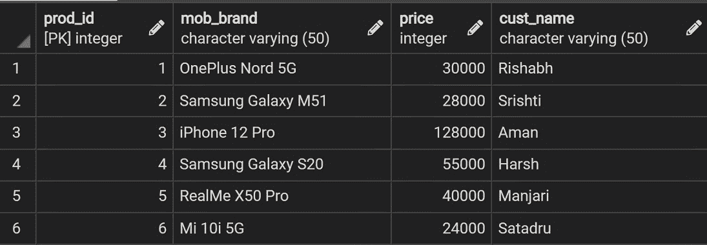

# SQL–选择总和

> 原文:[https://www.geeksforgeeks.org/sql-select-sum/](https://www.geeksforgeeks.org/sql-select-sum/)

SELECT SUM 用于计算 SQL 中表达式的总值。这与在 SQL 中使用 [**<u>【聚合】</u>**](https://www.geeksforgeeks.org/aggregate-functions-in-sql/) 函数 SUM()是一样的。

在本文中，我们将看到如何使用合适的例子在 SQL 中使用“SELECT SUM”。

**语法:**

```sql
SELECT SUM(expr)
FROM Table_Name
WHERE condition;

expr : Expression or column name
```

### **实施:**

**1。创建数据库:**

使用以下语法创建数据库:

```sql
CREATE DATABASE database_name
```

**2。创建表格:**

使用以下语法创建表格:

```sql
CREATE TABLE Table_name(
col_1 TYPE col_1_constraint,
col_2 TYPE col_2 constraint
.....
)

col: Column name
TYPE: Data type whether an integer, variable character, etc
col_constraint: Constraints in SQL like PRIMARY KEY, NOT NULL, UNIQUE, REFERENCES, etc
```

**3。插入表格:**

使用以下语法向表中插入数据:

```sql
INSERT INTO Table_name
VALUES(val_1, val_2, val_3, ..........)

val: Values in particular column
```

**4。查看表格:**

使用以下语法查看表格的内容:

```sql
SELECT * FROM Table_name
```

现在让我们来看看 SQL 中 SELECT SUM 函数的一些示例用例:

**例 1:** 考虑一个电商网站的手机购买明细，如下图:



采购信息表

**查询:**

找出所有在大十亿日销售的手机价格低于 55000 印度卢比的总和。


**例 2:** 我们再看一个使用 [**GROUP BY**](https://www.geeksforgeeks.org/sql-group-by/) 子句的例子。请考虑下面显示的组织的员工详细信息表，该表包含有关员工的工资、姓名和工作部门的信息。


**员工详细信息**

**查询:**

找出公司必须提供给每个部门员工的总支出。


在上面的结果中，我们可以看到人力资源部门的员工人数为 3 人，每个员工每月获得 5 万印度卢比的工资。所以，公司必须在人力资源部提供的总工资是每月 1，50000 印度卢比。