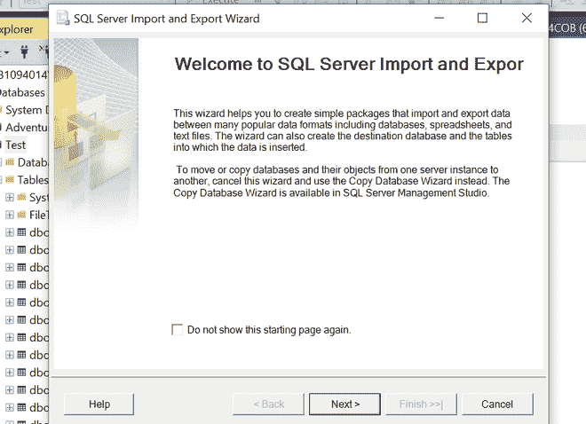
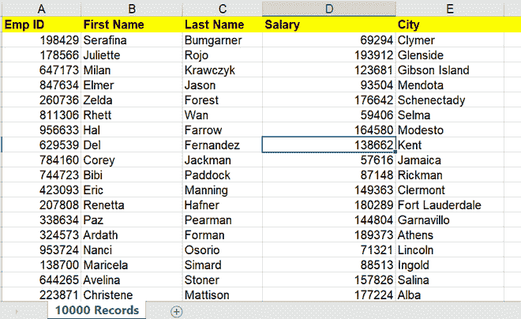
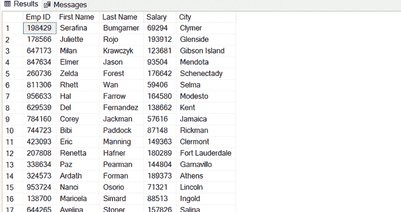

# SQL SERVER |使用 T-SQL 命令从 csv 文件批量插入数据

> 原文:[https://www . geesforgeks . org/SQL-server-bulk-insert-data-from-CSV-file-using-t-SQL-command/](https://www.geeksforgeeks.org/sql-server-bulk-insert-data-from-csv-file-using-t-sql-command/)

在本文中，我们将介绍在 SQL server 中使用 T-SQL 命令从 csv 文件中批量插入数据。并且还将覆盖执行这种操作更有用和更方便的方式。我们一个一个来讨论。

**简介:**
有时候有一种场景，我们必须从执行批量插入数据。csv 文件导入到 SQL Server 数据库中。我们可以使用 SSMS 的图形用户界面(SQL Server Management Studio)从 Excel、CSV 等文件导入数据。如果我们有数百万的数据要导入，上面的工作会很耗时，那么，现在您将看到如何处理这类操作。



**注意–**
需要插入和管理批量操作权限。

**替代方法:**
在本文中，我们将通过几行 T-SQL 命令提供一个更快的替代方法。

```sql
BULK INSERT <DATABASE NAME>.<SCHEMA NAME>.<TABLE_NAME>
FROM '<FILE_PATH>'
WITH
(
-- input file format options
   [ [ , ] FORMAT = 'CSV' ]
   [ [ , ] FIELDQUOTE = 'quote_characters']
   [ [ , ] FORMATFILE = 'format_file_path' ]
   [ [ , ] FIELDTERMINATOR = 'field_terminator' ]
   [ [ , ] ROWTERMINATOR = 'row_terminator' ]
    )]
)
```

最常用的输入参数如下。

1.  **field terminator–**'
    ' field _ terminator '用作字段之间的分隔符。默认字段结束符是\t(制表符)。

2.  **row terminator–**
    “row _ terminator”用于指定行尾。默认的行结束符是\r\n(换行符)。

**将 CSV 文件导入到 SQL 表中:**
这里我们将讨论在 SQL server 中将 CSV 文件导入到表中。请考虑下面给出的 csv 文件，或者您可以使用自己的 CSV 文件来执行此操作。让我们尝试在 SQL Server 中将 csv 文件导入到我们的 SQL 表中。



现在，让我们创建一个 SQL 表来存储上面的数据。

**在此创建表格–**
。我们将根据 csv 文件记录创建表模式。

```sql
USE [Test]--Database name

CREATE TABLE [dbo].[Employee](                              
[Emp ID] bigint primary key,
[First Name] [varchar](50) NULL,
[Last Name] [varchar](50) NULL,
[Salary] bigint,
[City] [varchar](50)
)
```

**大容量插入–**
现在让我们将文件大容量插入员工 SQL 表:

```sql
BULK INSERT [Test].[dbo].[Employee]
FROM 'C:\data\employee_data.csv'
WITH (FIRSTROW = 2,
    FIELDTERMINATOR = ',',
    ROWTERMINATOR='\n' );
```

**输出–**
执行上述操作后，我们可以看到记录已经用几行代码插入到 Employee 表中，如下所示。



**参考资料:**
欲了解输入格式选项的更多信息，请访问[？view = SQL-server-2017 #输入-文件-格式-选项。](https://docs.microsoft.com/en-us/sql/t-sql/statements/bulk-insert-transact-sql?view=sql-server-2017#input-file-format-options)