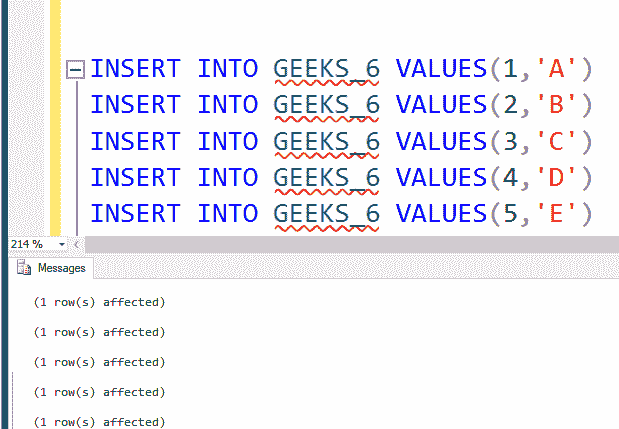

# SQL SERVER |在条件下

> 原文:[https://www.geeksforgeeks.org/sql-server-condition/](https://www.geeksforgeeks.org/sql-server-condition/)

IN 条件是 SELECT、INSERT、UPDATE 或 DELETE 语句中多个 OR 条件的替代条件。IN 运算符允许根据表达式测试多个值，因此减少了对每个测试值使用多个或条件。

**语法:**

```sql
expression IN (value1, value2, .... value_n);

```

**凡**T2**1。表达式:**待测值/属性。
**2。值 1，值 2，..value_n :** 根据表达式测试的值。

### 示例:

### 创建表格 GEEKS _ 6


### 将值插入表 GEEKS_6:



### 极客 6 内容:


**使用**【或】选择多个值。**** 必须使用多个或来检查表达式。


使用**‘IN’**可以回答相同的查询，这减少了必须写入条件的次数，并且所有测试值都出现在一个地方。
**在查询:**


### 示例 2:在两个表中使用“IN”>

### 创建表 GEEKS_7:


### 将值插入表 GEEKS_7:


### 极客 7 内容:


### 查询:使用“输入”从两个表中查找公共元素


**说明:**
首先执行内部查询，选择 Table Geeks_7 的**【名称】**列中的所有值。然后外部查询将开始执行，它将使用内部查询值来过滤掉匹配的值。