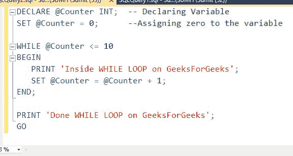
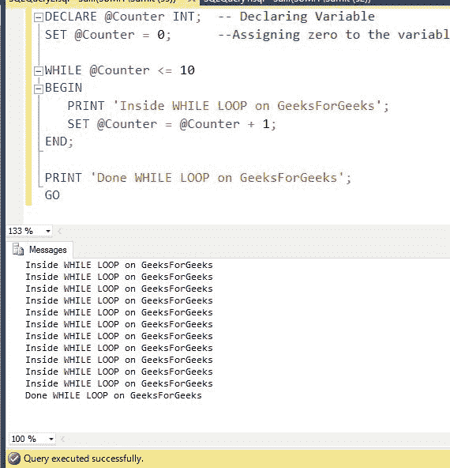
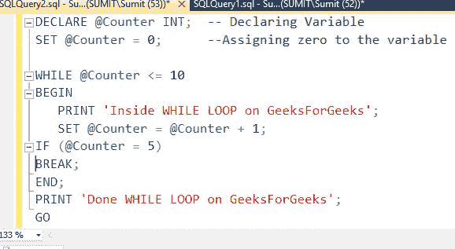
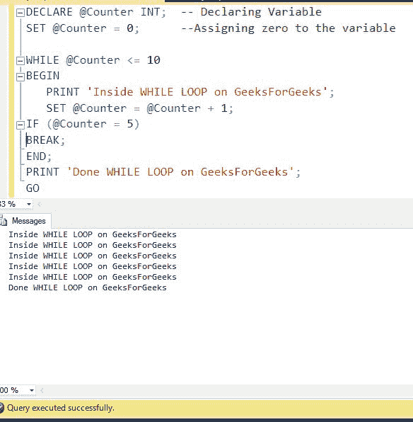
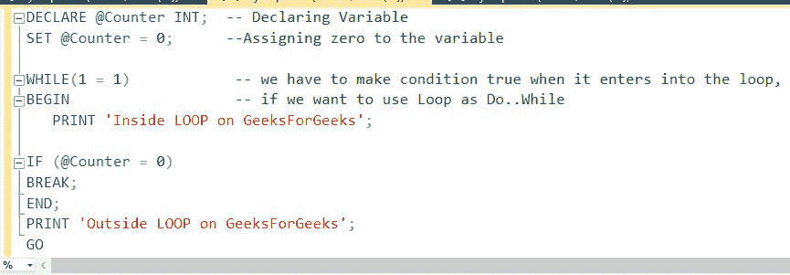
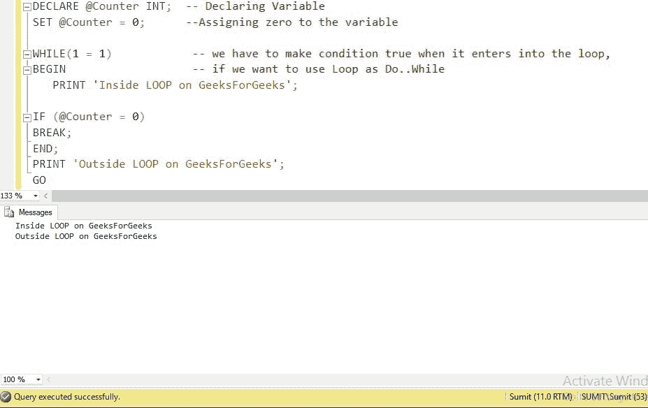
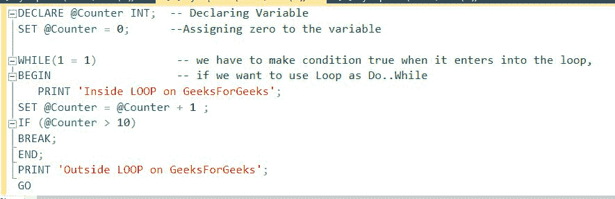
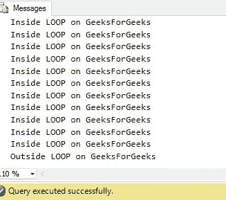
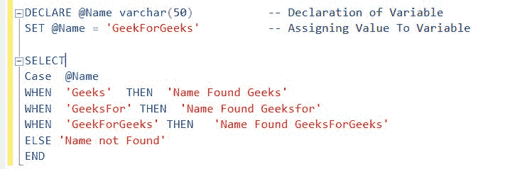
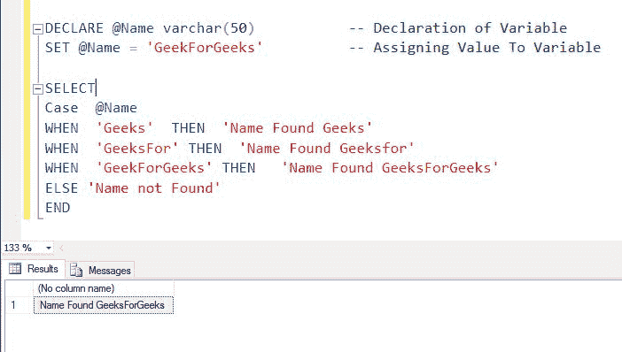

# SQL SERVER |条件语句

> 原文:[https://www . geesforgeks . org/SQL-server-conditional-statements/](https://www.geeksforgeeks.org/sql-server-conditional-statements/)

**While 循环:**在 SQL SERVER 中，While 循环可以以与任何其他编程语言类似的方式使用。while 循环将首先检查条件，然后只要条件评估为真，就执行其中的 SQL 语句块。

**语法:**

```
WHILE condition
BEGIN
   {...statements...}
END;

```

**参数:**
**1。条件:**在循环的每一次通过中测试条件。如果条件评估为真，则执行循环体，否则循环终止。
**2。语句:**每次循环中需要执行的语句。

**例:**


**输出:**


**Break 语句:** BREAK 语句，顾名思义就是用来中断控制流的。它可以像任何其他编程语言一样在 SQL 中使用。

**示例:带中断语句的 While 循环**



**输出:**


**注意:**在示例中，当变量值变为 5 时，执行 BREAK 语句，控件从循环中退出。

**Do-While 循环:** SQL server 没有 Do-While 循环的特性，但是通过在 While 循环中做很少的修改，可以实现相同的行为。

**例 1:**


**输出:**


**例 2:**


**输出:**


**CASE 语句:**在 SQL Server 中，CASE 语句的功能与 IF-THEN-ELSE 语句相同。

**语法:**

```
CASE Expression
   WHEN Con_1 THEN Output1 
   WHEN Con_2 THEN Output2
   WHEN Con_3 THEN Output3
   WHEN Con_4 THEN Output4
   ...
   WHEN Con_n THEN Outputn
   ELSE output
END

```

**参数:**
**1。表达式:**要与条件列表进行比较的值(可选)。
**2。Con_1、Con_2、…Con_n:** 条件是必需的，并按照列出的顺序进行评估。一旦条件为真，CASE 函数将返回结果，不再进一步评估条件。
**3。Output1，Output2，…Outputn:** 条件评估为真时要打印的输出。

**例:**

**输出:**
