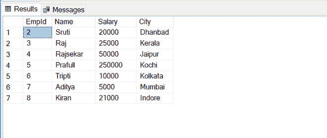
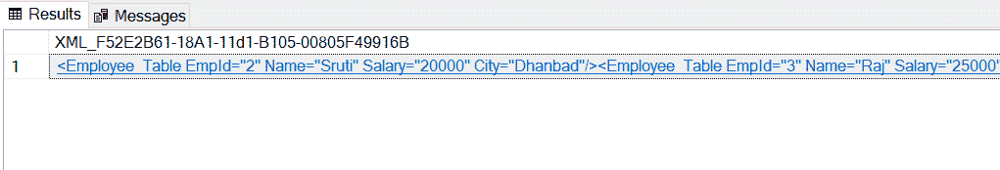
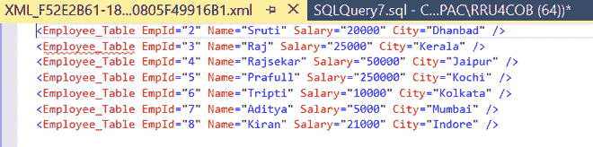
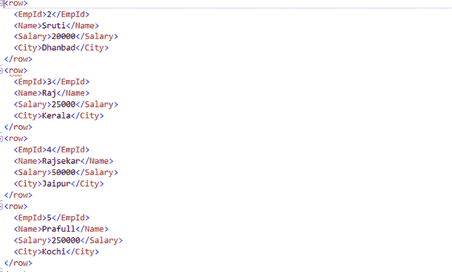

# SQL Server |将 T-SQL 中的表转换为 XML

> 原文:[https://www . geesforgeks . org/SQL-server-convert-tables-in-t-SQL-to-XML/](https://www.geeksforgeeks.org/sql-server-convert-tables-in-t-sql-into-xml/)

在本文中，我们将重点讨论如何在 T-SQL 中将表转换为 SQL server 中的 XML。您将能够理解如何在命令的帮助下转换它。我们一个一个来讨论。

**概述:**
[XML(可扩展标记语言)](https://www.geeksforgeeks.org/xml-basics/)是一种类似于 HTML 的标记语言，旨在不同平台之间共享信息。在这里，您将了解如何将 T-SQL 中的表转换为 XML。

**示例–**
下面是一个示例 XML 文档，如下所示。

```
<email>
 <to>Manager</to>
 <from>Sruti</from>
 <heading>Work Status</heading>
 <body>Work Completed</body>
</email>
```

**将 T-SQL 中的表转换为 XML :**
使用以下步骤将 T-SQL 中的表转换为 XML。让我们首先生成一个雇员表来存储少数雇员的数据，以便创建 XML 文档。

**创建表格–**员工 _ 表格

```
CREATE TABLE Employee_Table  
(  
EmpId int identity(1,1) primary key,  
Name varchar(100),  
Salary int ,  
City varchar(20)  
)  
```

**将数据插入员工表–**

```
insert into Employee_Table ( Name,City,Salary)
VALUES
('Sruti','Dhanbad',20000),
('Raj','Kerala',25000),
('Rajsekar','Jaipur',50000),
('Prafull','Kochi',250000),
('Tripti','Kolkata',10000),
('Aditya','Mumbai',5000),
('Kiran','Indore',21000)
```

**读取数据进行验证–**

```
SELECT * FROM Employee_Table
```

**输出:**



**将 T-SQL 中的表转换成 XML 的方法:**
将 SQL 表中的数据转换成 XML 格式有两种常见的方法，如下所示。

**使用 FOR XML AUTO–**
FOR XML AUTO 类创建一个 XML 文档，其中每一列都是一个属性。

```
SELECT * FROM Employee_Table
FOR XML AUTO
```

**输出:**



该查询将创建一个超链接作为输出。单击该链接，我们将在 SSMS 的新查询窗口中看到如下文档。



**使用 FOR XML PATH 子句–**
FOR XML PATH 将创建一个 XML 文档，其中每行都嵌入到<行>和</行>子句中。每一行的每一列值都嵌入到<列名>和</列名>子句中。

```
SELECT * FROM Car
FOR XML PATH
```

**输出:**

