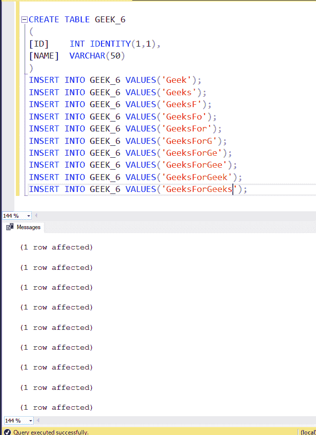
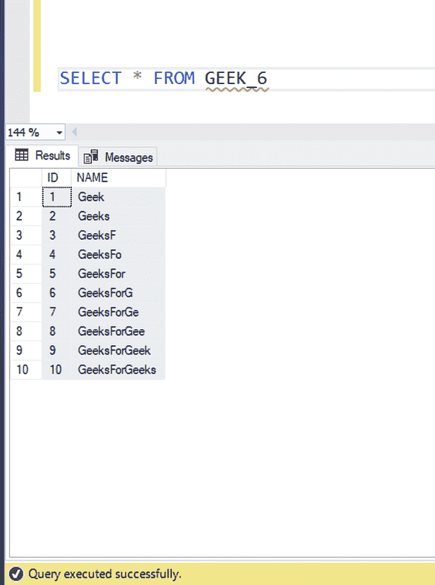
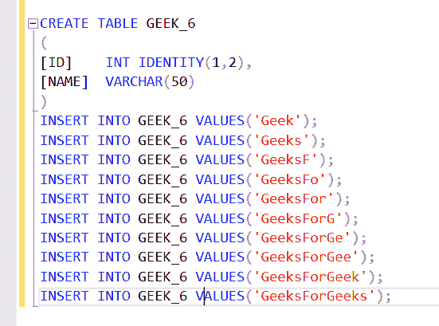
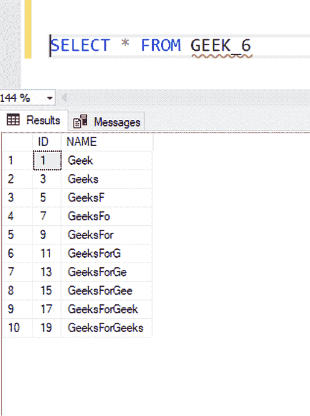

# SQL 服务器标识

> 原文:[https://www.geeksforgeeks.org/sql-server-identity/](https://www.geeksforgeeks.org/sql-server-identity/)

表的标识列是其值自动增加的列。标识列中的值由服务器创建。用户通常不能在标识列中插入值。标识列可用于唯一标识表中的行。

**语法:**

```
IDENTITY [( seed, increment)]

Seed: Starting value of a column. 
      Default value is 1.

Increment: Incremental value that is 
added to the identity value of the previous 
row that was loaded. The default value 1.

```

### 例 1:



### 表格内容



### 注意:

该表的“标识”列从 1 开始，因为提供的种子值是 1，每行递增 1。

### 例 2:



### 表格内容



### 注意:

该表的“标识”列从 1 开始，但随着在创建“标识”列时将增量值作为 2 传递，该列将增加 2。