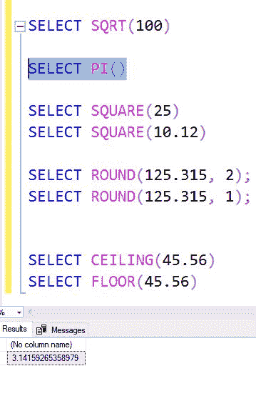

# SQL Server 数学函数(SQRT、PI、SQUARE、ROUND、天花板& FLOOR)

> 原文:[https://www . geesforgeks . org/SQL-server-数学-函数-sqrt-pi-正方形-圆形-天花板-地板/](https://www.geeksforgeeks.org/sql-server-mathematical-functions-sqrt-pi-square-round-ceiling-floor/)

数学函数存在于 SQL server 中，可用于执行数学计算。下面给出一些常用的数学函数:
**1。SQRT():**
SQRT()函数是最常用的函数。它接受任何数值，并返回该数值的平方根值。

**语法:**

```
SELECT SQRT(..value..)
```

**例:**


**2。PI():** 有些计算需要使用 PI。使用 pi()函数，PI 的值可以在查询中的任何地方使用。

**语法:**

```
SELECT PI()
```

示例:


**3。SQUARE():** SQUARE()函数用于求任意数的平方。

**语法:**

```
SELECT SQUARE(..value..)
```

**例:**


**4。ROUND():** ROUND()函数用于将一个值舍入到最接近的指定小数位。

**语法:**

```
SELECT ROUND(..value.., number_of_decimal_places)
```

**例:**


**5。天花板()和地板()**
**天花板():**天花板()函数用于查找下一个最高值(整数)。

**语法:**

```
SELECT CEILING(..value..)
```

**FLOOR():** FLOOR()函数返回下一个最低值(整数)。
**语法:**

```
SELECT FLOOR(..value..)
```

**例:**
