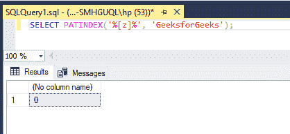

# SQL Server–PATINDEX()函数

> 原文:[https://www.geeksforgeeks.org/sql-server-patindex-function/](https://www.geeksforgeeks.org/sql-server-patindex-function/)

SQL server 中的 PATINDEX()函数用于返回字符串或指定表达式中第一个模式的起始索引。

*   如果找不到模式，它将返回零。
*   如果模式或表达式为空，则返回空值。
*   起始索引为 1。

### 语法:

```
PATINDEX ( '%pattern%' , expression )
```

有两个参数，而且都是必需的。

*   **模式–**这是字符串中必须用%包围的序列。模式中可以使用其他通配符。该模式限制为 8000 个字符。其他通配符是“%”、“-”、“[]”、'[^]'.
*   **表达式–**搜索指定模式的字符串。

### 适用于:

函数 PATINDEX()适用于以下数据库。

*   SQL Server(所有支持的版本)
*   蓝色数据库
*   蔚蓝 SQL 数据仓库
*   Azure SQL 托管实例
*   Azure Synapse 分析平台系统(PDW)
*   并行数据仓库

假设我们想在字符串“GeeksforGeeks”中找到第一个出现的“ek”。那么查询将是这样的:

**查询:**

```
SELECT PATINDEX('%ek%', 'GeeksforGeeks');
```

**输出:**

```
3
```


现在，如果我们在字符串“GeeksforGeeks”中找到第一个字母“z”。

**查询:**

```
SELECT PATINDEX('%[z]%', 'GeeksforGeeks');
```

**输出:**

它返回 0，因为给定的字符串不包含字母“z”。

```
0
```



再举一个例子，在字符串“你好吗？”。

**查询:**

```
SELECT position = PATINDEX('%[^ 0-9A-z]%', 'How are you?');
```

**输出:**

```
12
```

