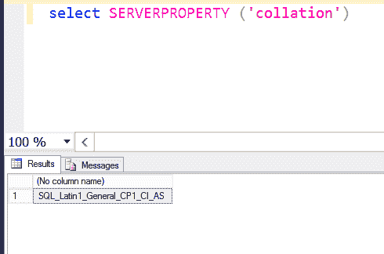

# SQL Server | SERVERPROPERTY()

> 原文:[https://www.geeksforgeeks.org/sql-server-serverproperty/](https://www.geeksforgeeks.org/sql-server-serverproperty/)

SQL Server 提供了一个系统定义函数**SERVERPROPERTY(property name)**。

**SERVERPROPERTY():**SERVERPROPERTY()函数用于返回系统不同属性的信息或者所谓的实例信息。

**propertyname:** 该表达式包含关于所讨论的属性的信息，并返回相同的信息。

下面是 SERVERPROPERTY()函数提供的一些属性名称。除了上述属性，还有其他属性。

**1。MachineName:** 此属性名在 SERVERPROPERTY()函数中用作参数，用于查找运行 SQL Server 的机器/计算机的名称。

**语法:**

```
SELECT SERVERPROPERTY ('MachineName')

```

**例:**


**输出:**


**2。版本:**这个属性名在 SERVERPROPERTY()函数中作为参数，用来获取机器/计算机上安装的 SQL Server 的版本。

**语法:**

```
SELECT SERVERPROPERTY ('Edition')

```

**例:**


**3。instancedfaultdatapath:**这个属性名在 SERVERPROPERTY()函数中用作参数，用来查找数据文件的默认路径。

**语法:**

```
SELECT SERVERPROPERTY ('INSTANCEDEFAULTDATAPATH')

```

**例:**


**4。INSTANCEDEFAULTLOGPATH:** 此属性名在 SERVERPROPERTY()函数中用作参数，以查找日志文件的默认路径。

**语法:**

```
SELECT SERVERPROPERTY ('INSTANCEDEFAULTLOGPATH')

```

**例:**


**5。PRODUCTVERSION:** 此属性名在 SERVERPROPERTY()函数中用作参数，以获取有关正在使用的产品版本的信息。

**语法:**

```
SELECT SERVERPROPERTY (' PRODUCTVERSION')

```

**例:**


**6。BUILD CLVERSION:**此属性名在 SERVERPROPERTY()函数中用作参数，以获取有关微软版本的信息。NET 框架公共语言运行时。该框架用于构建 SQL Server 实例。

**语法:**

```
SELECT SERVERPROPERTY ('BUILDCLRVERSION')

```

**例:**


**7。PROCESSID:** 此属性名在 SERVERPROPERTY()函数中用作参数，以获取 SQL Server 服务的进程 ID。

**语法:**

```
SELECT SERVERPROPERTY ('PROCESSID')

```

**例:**


**8。ResourceLastUpdateDateTime:** 此属性名在 SERVERPROPERTY()函数中用作参数，以获取有关资源数据库上次更新的信息，即资源数据库上次更新的日期和时间。

**语法:**

```
SELECT SERVERPROPERTY ('ResourceLastUpdateDateTime')

```

**例:**


**9。EditionID:** 此属性名在 SERVERPROPERTY()函数中用作参数，用于查找计算机/机器上正在安装的 SQL Server 的版本 ID。

**语法:**

```
SELECT SERVERPROPERTY ('EditionID')

```

**例:**


**10。排序规则:**此属性名在 SERVERPROPERTY()函数中用作参数，用于查找计算机/机器上安装的 SQL Server 的排序规则。

**语法:**

```
select SERVERPROPERTY ('collation')
```

**示例:**



**注意:**要获取其他属性的信息，请参考[微软文档](https://docs.microsoft.com/en-us/sql/t-sql/functions/serverproperty-transact-sql)。