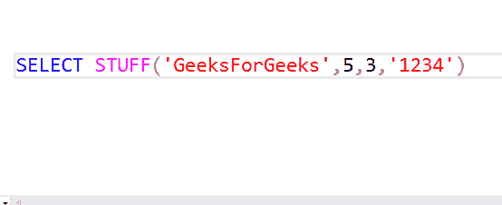
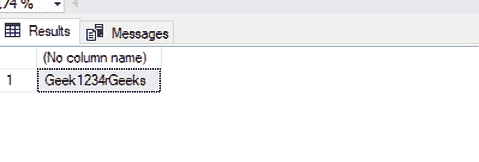
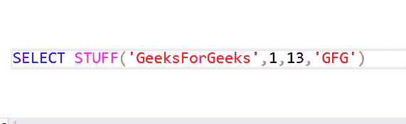
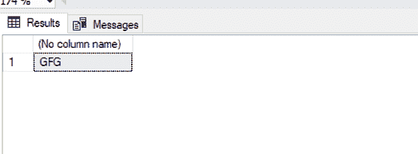
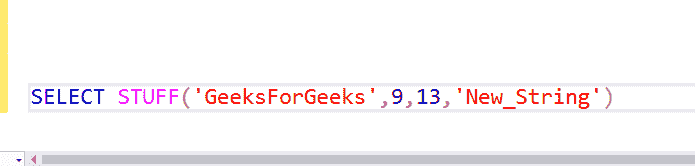
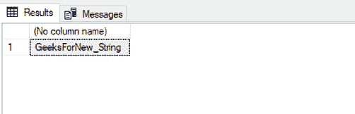

# SQL Server | STUFF()函数

> 原文:[https://www.geeksforgeeks.org/sql-server-stuff-function/](https://www.geeksforgeeks.org/sql-server-stuff-function/)

有些情况下，用户希望更改插入的数据的某一部分。原因可能是人为错误或数据的变化。为此，stuff()函数开始起作用。

**STUFF() :**
在 SQL Server 中，STUFF()函数用于从源字符串中删除给定长度的字符序列，并从指定的起始索引中插入给定的字符序列。

**语法:**

```sql
STUFF (source_string, start, length, add_string)
```

**在哪里:-**
**1。来源 _ 字符串:**待修改的原字符串。
**2。start:** 起始索引，给定长度的字符将从该索引中删除，并插入新的字符序列。
**3。长度:**原始字符串中要从起始索引中删除的字符数。
**4。add_string:** 要插入的新字符集(字符串)，以代替起始索引中已删除的字符。

**注意:**新字符串的长度和要删除的字符数不必相同。

**例 1:**



**输出:**



**例 2:**



**输出:**



**例 3:**



**输出:**

