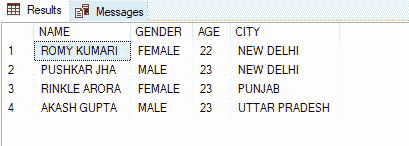
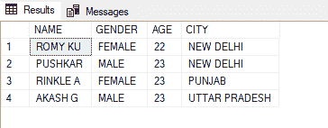
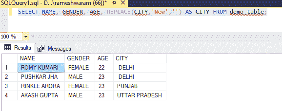
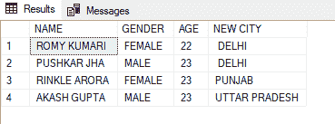

# 删除部分字符串的 SQL 语句

> 原文:[https://www . geesforgeks . org/SQL-语句移除字符串的一部分/](https://www.geeksforgeeks.org/sql-statement-to-remove-part-of-a-string/)

这里我们将看到删除部分字符串的 SQL 语句。

### **方法一:使用 SUBSTRING()和 LEN()函数**

如果我们想移除字符串中位置已知的部分，我们将使用这个方法。

**1。SUBSTRING()** :该函数用于从给定位置的字符串中找到一个[子字符串](https://www.geeksforgeeks.org/substring-function-in-sql-server/)。它需要三个参数:

*   字符串:这是必需的参数。它提供了关于应用函数的字符串的信息。
*   开始:它给出了字符串的开始位置。它也是必需的参数。
*   长度:这是一个可选参数。默认取整个[弦](https://www.geeksforgeeks.org/sql-string-functions/)的长度。

**2。LEN():** 语法不是标准语法。对于不同的服务器语法，返回字符串的长度可能会有所不同。例如， [LEN()](https://www.geeksforgeeks.org/len-function-in-sql-server/) 用在 SQL server 中，LENGTH()用在 oracle 数据库中，等等。它只接受一个参数，即您需要查找其长度的字符串。

让我们用一个例子来看看上面提到的这些函数。假设要删除字符串中不需要的部分，我们将从字段的字符串中只提取需要的部分，我们将使用以下查询:

**步骤 1:** 创建[数据库](https://www.geeksforgeeks.org/create-database-in-ms-sql-server/)

使用下面的 SQL 语句创建名为极客的数据库；

**查询:**

```sql
CREATE DATABASE geeks;
```

**步骤 2:** 使用数据库

使用下面的 SQL 语句将数据库上下文切换到极客:

**查询:**

```sql
USE geeks;
```

**步骤 3:** 表格创建

我们的极客数据库中有以下演示表。

**查询:**

```sql
CREATE TABLE demo_table(
NAME VARCHAR(20),
GENDER VARCHAR(20),
AGE INT,
CITY VARCHAR(20) );
```

**步骤 4:** 将数据插入表格

**查询:**

```sql
INSERT INTO demo_table VALUES
('ROMY KUMARI', 'FEMALE', 22, 'NEW DELHI'),
('PUSHKAR JHA', 'MALE',23, 'NEW DELHI'),
('RINKLE ARORA', 'FEMALE',23, 'PUNJAB'),
('AKASH GUPTA', 'MALE', 23, 'UTTAR PRADESH');
```

**第五步:**查看表**的数据**

**查询:**

```sql
SELECT * FROM demo_table;
```

**输出:**



**第 6 步:**移除部分字符串

假设我们想从字符串中删除最后 4 个字符，那么我们将使用下面的语句提取剩余部分。

**语法:**

```sql
SELECT SUBSTRING(column_name,1,length(column_name)-4) FROM table_name;
```

**示例:**

从名称字段中删除最后 4 个字符。

**查询:**

```sql
SELECT SUBSTRING(NAME,1,len(NAME)-4) AS NAME, GENDER, AGE, CITY FROM demo_table;
```

**输出:**



### **方法二:使用 REPLACE()功能**

我们可以使用 [REPLACE()功能](https://www.geeksforgeeks.org/replace-string-in-sql-server/)来[移除绳子的](https://www.geeksforgeeks.org/sql-delete-statement/)部分。如果我们知道要删除的字符串的确切字符，我们可以使用这个函数。

**REMOVE():** 该函数替换新子串中出现的所有子串。它需要三个参数，都是必需的参数。

*   需要字符串。原始字符串
*   old_string 必需。要替换的字符串
*   new_string 必需。新的替换字符串

**语法:**

```sql
REPLACE(string, old_string, new_string)
```

我们将使用上面的 demo_table 进行演示。假设我们从 demo_table 的 CITY 字段中删除“New”，那么查询将是:

**查询:**

```sql
SELECT NAME, GENDER, AGE, REPLACE(CITY,'New','') AS CITY FROM demo_table;
```

我们不会用新的字符串替换它。

**输出:**



### **方法三:使用 TRIM()功能**

[**【TRIM():**](https://www.geeksforgeeks.org/trim-function-in-sql-server/)**此功能从字符串的开头或结尾删除空格字符或其他指定字符。通过使用这个函数，我们不能从字符串的中间移除字符串的一部分。**

****语法:****

```sql
TRIM([characters FROM ]string);
```

**我们将使用上面的 demo_table 进行演示。假设我们想从 demo_table 的 CITY 字段中删除“New”，那么查询将如下所示:**

****查询:****

```sql
SELECT NAME, GENDER, AGE, TRIM ('NEW' FROM CITY)AS "NEW CITY"  FROM demo_table;
```

****输出:****

****