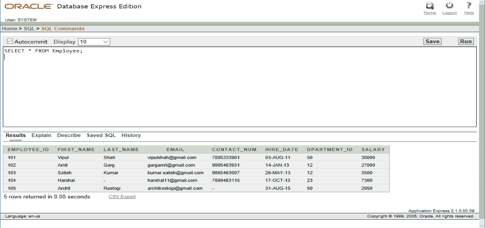
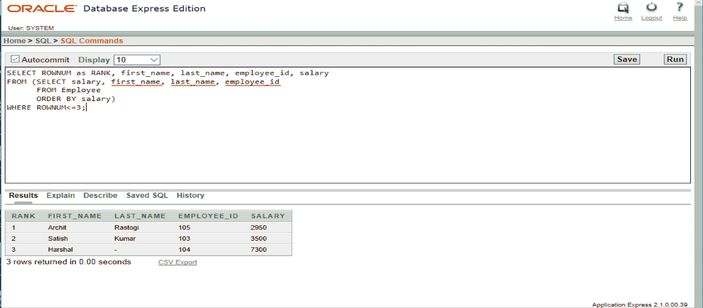
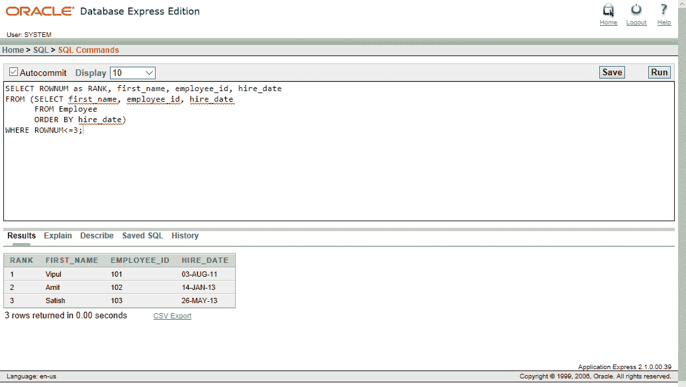
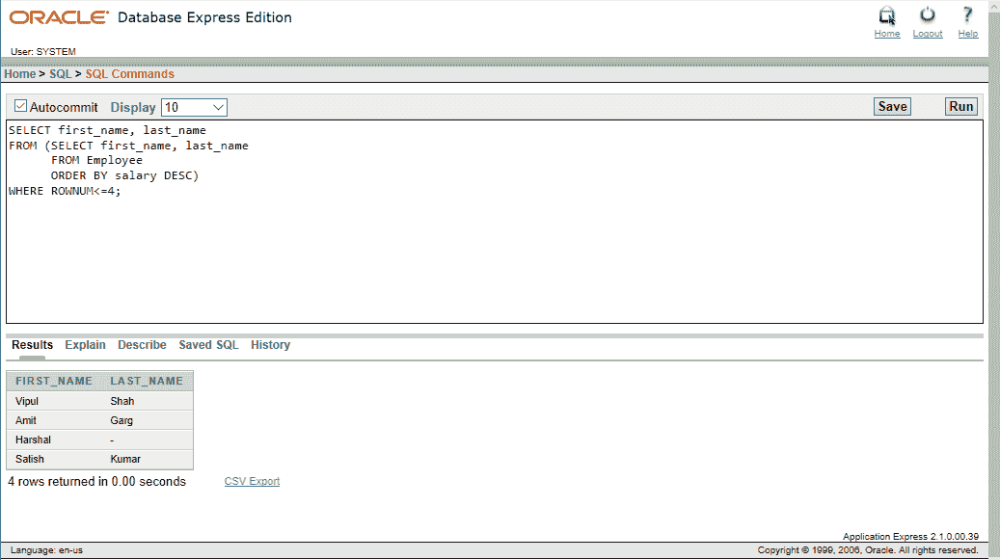
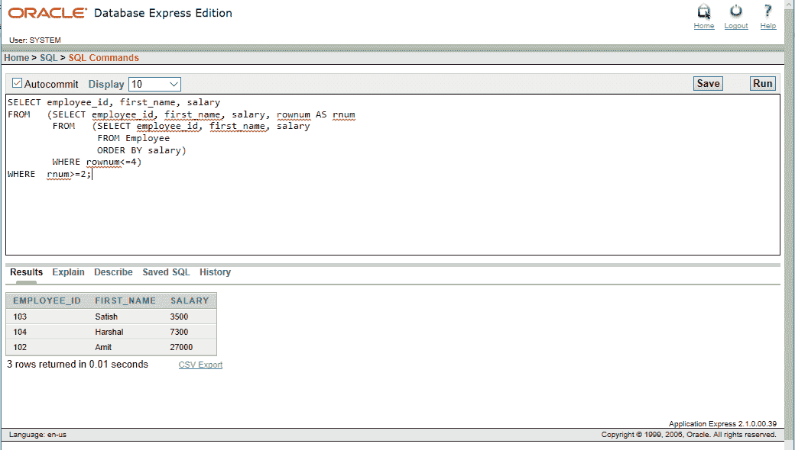
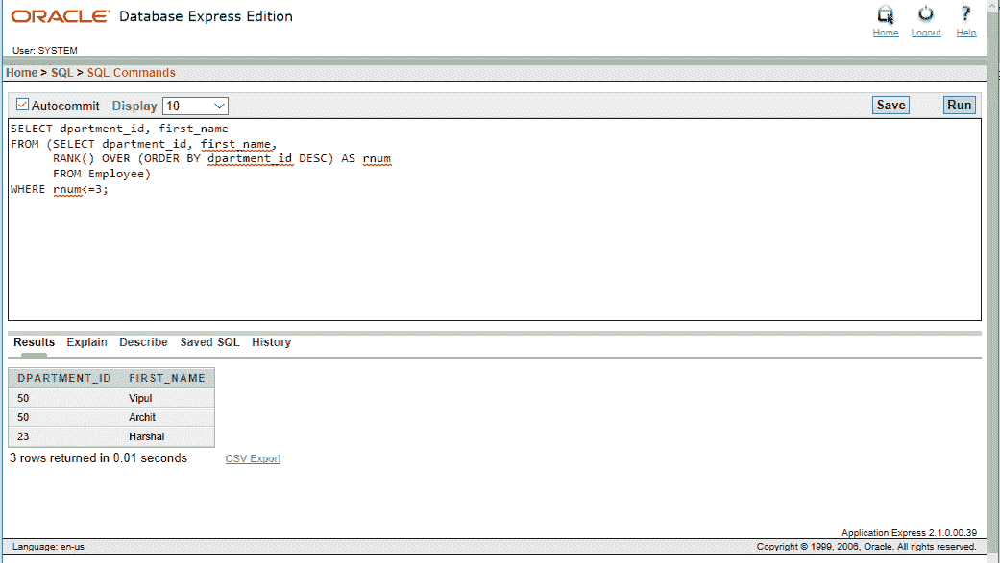
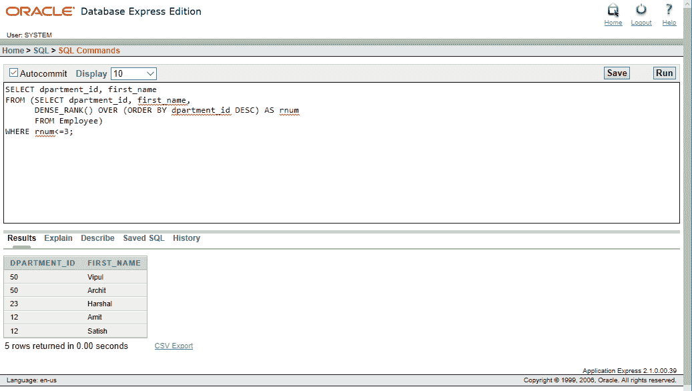
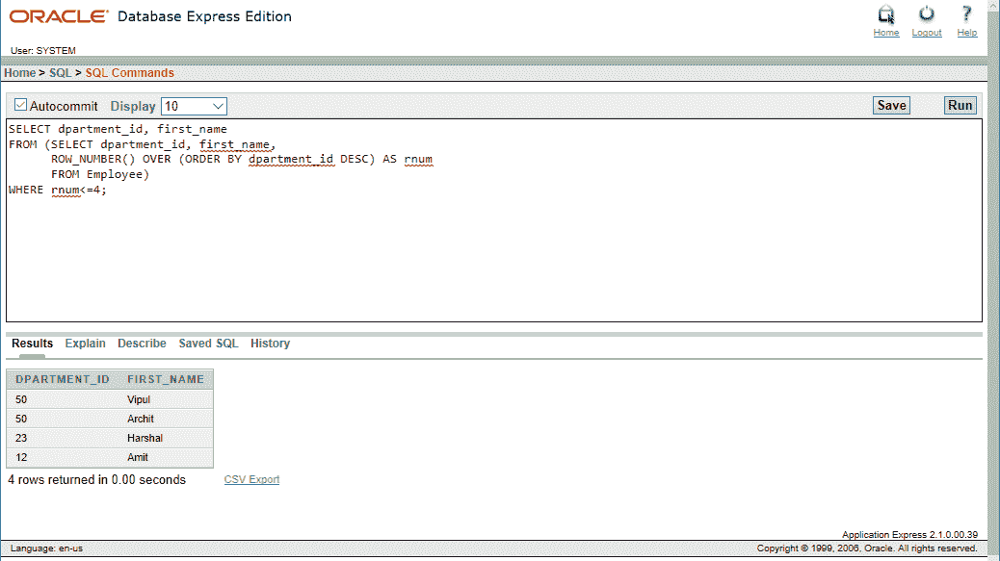

# SQL |前 N 个查询

> 原文:[https://www.geeksforgeeks.org/sql-top-n-queries/](https://www.geeksforgeeks.org/sql-top-n-queries/)

**SQL 中的 Top-N 分析**处理如何限制从 SQL 中的有序数据集返回的行数。
Top-N 查询要求一列的最小或最大值 *n* 。最小和最大值集都被认为是前 N 个查询。遵循这种类型的搜索技术可以节省大量时间和复杂性。在需要根据条件仅显示表格中最底部的 *n 条*或最顶部的 *n 条*
*条*条记录的情况下，Top-N 分析非常有用。该结果集可用于进一步分析。

**例如，使用 Top-N 分析，我们可以执行以下类型的查询:**

*   过去两个月销量最高的前五款产品。
*   卖出最高保单的前三大代理商。
*   在期末考试中得分最低的两个学生。

**执行前 N 分析**

按照下面提到的查询，我们可以很容易地理解 SQL 中 Top-N 分析的工作方式:
**语法:**

```sql
SELECT *[column_list]*, ROWNUM
FROM (SELECT *[column_list]*
      FROM *table_name*
      ORDER BY *Top-N_clolumn*)
WHERE ROWNUM<=N;

```

***我们将在名为*** 的下表中执行各种命令



**例 1:**

```sql
Input : 
SELECT ROWNUM as RANK, first_name, last_name, employee_id, salary
FROM (SELECT salary, first_name, last_name, employee_id
      FROM Employee
      ORDER BY salary)
WHERE ROWNUM<=3;

```

**输出:**



**说明:**在上面的 SQL 语句中，显示了薪资前 3 名的员工的必填字段。结果按工资的递增顺序显示。

**例 2:**

```sql
Input : 
SELECT ROWNUM as RANK, first_name, employee_id, hire_date
FROM (SELECT first_name, employee_id, hire_date
      FROM Employee
      ORDER BY hire_date)
WHERE ROWNUM<=3;

```

**输出:**



**说明:**在上面的 SQL 语句中，显示了最早雇佣的 3 名员工的必填字段。结果按照雇用日期的递增顺序显示。

**使用 Top-N 分析的不同风格**

*   **Inline View and ROWNUM :** The classic Top-N style query uses an ordered inline view to force the data into the correct order which then finally uses the ROWNUM check to limit the data returned. 

    **例:**

```sql
Input : 
SELECT first_name, last_name
FROM (SELECT first_name, last_name
      FROM Employee
      ORDER BY salary DESC)
WHERE ROWNUM<=4;

```

*   **输出:**



*   **说明:**在上面的 SQL 语句中，显示了薪资最高的 4 名员工的必填字段。变更通过*订单*条款完成。
*   **嵌套内联视图和 ROWNUM :** 这个方法也可以用于分页数据，就像分页的 web 报表一样。
    **例:**

```sql
Input :
SELECT employee_id, first_name, salary
FROM   (SELECT employee_id, first_name, salary, rownum AS rnum
        FROM   (SELECT employee_id, first_name, salary
                FROM Employee
                ORDER BY salary)
        WHERE rownum<=4)
WHERE  rnum>=2;

```

*   **输出:**



*   **解释:**在上面的 SQL 语句中，首先运行内部查询，并将其输出提供给外部查询，然后外部查询最终给出我们想要的输出。
*   **使用 RANK 函数:**RANK 解析函数为输出中的每个不同值分配一个顺序的秩。
    **例:**

```sql
Input : 
SELECT dpartment_id, first_name
FROM (SELECT dpartment_id, first_name,
      RANK() OVER (ORDER BY dpartment_id DESC) AS rnum 
      FROM Employee)
WHERE rnum<=3;

```

*   **输出:**



*   **说明:**在上面的 SQL 语句中，RANK()函数还充当了一个虚拟字段，其值在末尾被限制。RANK()函数没有给出前 N 行或者前 N 个不同的值。返回的行数取决于数据中重复的行数。
*   **使用 DENSE_RANK 函数:**DENSE _ RANK 解析函数类似于 RANK()函数。不同的是，等级被压缩，因此没有间隙。
    **例:**

```sql
Input : 
SELECT dpartment_id, first_name
FROM (SELECT dpartment_id, first_name,
      DENSE_RANK() OVER (ORDER BY dpartment_id DESC) AS rnum 
      FROM Employee)
WHERE rnum<=3;

```

*   **输出:**



*   **说明:**在上面的 SQL 语句中，DENSE_RANK()函数也给重复的值分配相同的秩，但是秩序列中没有间隙。因此，它总是给我们一个*前 N 名不同的值*的结果。
*   **使用 ROW_NUMBER 函数:**ROW _ NUMBER 解析函数类似于 ROWNUM 虚拟列，但与所有解析函数一样，它的动作可以根据数据的顺序限制为特定的数据输出。
    **例:**

```sql
Input : 
SELECT dpartment_id, first_name
FROM (SELECT dpartment_id, first_name,
      ROW_NUMBER() OVER (ORDER BY dpartment_id DESC) AS rnum 
      FROM Employee)
WHERE rnum<=4;

```

*   **输出:**



*   **说明:**在上面的 SQL 语句中，ROW_NUMBER()将只选择前 N 个值，而不考虑它们是否重复。