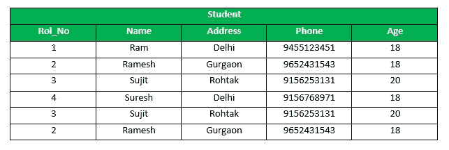
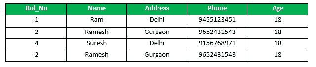
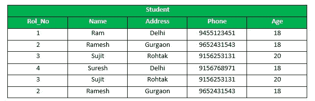
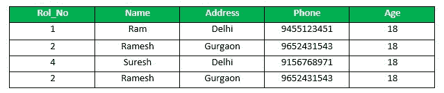
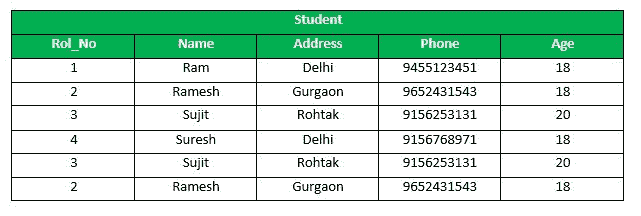

# SQL | TRANSACTIONS

> 原文:[https://www.geeksforgeeks.org/sql-transactions/](https://www.geeksforgeeks.org/sql-transactions/)

**什么是交易？**

事务将一组任务组合成一个执行单元。每个事务从一个特定的任务开始，当组中的所有任务成功完成时结束。如果任何任务失败，事务就会失败。因此，一笔交易只有两个结果:**成功**或**失败**。

不完整的步骤会导致交易失败。根据定义，数据库事务必须是原子的、一致的、隔离的和持久的。这些通常被称为
[酸性](https://en.wikipedia.org/wiki/ACID)属性。

**如何用 SQL 实现事务？**

以下命令用于控制事务。需要注意的是，这些语句不能在创建表时使用，只能与–INSERT、UPDATE 和 DELETE 等 DML 命令一起使用。

**1。BEGIN TRANSACTION:** 它表示显式或本地事务的起始点。

**语法:**

```
BEGIN TRANSACTION transaction_name ;
```

**2。设置事务:**为事务命名。

**语法:**

```
SET TRANSACTION [ READ WRITE | READ ONLY ];

```

**3。提交:**如果单个事务中的所有语句都是有序的，所有的更改都会一起记录在数据库中，这称为**提交**。COMMIT 命令将自上次 COMMIT 或 ROLLBACK 命令以来的所有事务保存到数据库中。

**语法:**

```
COMMIT;

```

**例:样表 1**



下面是一个示例，它将从表中删除那些年龄= 20 的记录，然后提交数据库中的更改。
**查询:**

```
DELETE FROM Student WHERE AGE = 20;
COMMIT;

```

**输出:**
因此，表中的两行将被删除，SELECT 语句看起来像，



**4。回滚:**如果任何 SQL 分组语句出现任何错误，则需要中止所有更改。逆转变化的过程称为**回退**。此命令只能用于撤消自上次发出 COMMIT 或 ROLLBACK 命令以来的事务。
**语法:**

```
ROLLBACK;

```

**示例:**
从上面的示例中**示例表 1** 、
删除表中那些年龄= 20 的记录，然后回滚数据库中的更改。
**查询:**

```
DELETE FROM Student WHERE AGE = 20;
ROLLBACK;

```

**输出:**



**5。保存点:**在要回滚的事务组中创建点。
保存点是事务中的一个点，您可以将事务回滚到某个点，而无需回滚整个事务。

**保存点命令语法:**

```
SAVEPOINT SAVEPOINT_NAME;

```

该命令仅用于在所有事务中创建保存点。
一般来说，ROLLBACK 用于撤销一组事务。
**回滚到保存点命令的语法:**

```
ROLLBACK TO SAVEPOINT_NAME;

```

您可以随时回滚到任何保存点，以将适当的数据返回到其原始状态。
**示例:**
从上面的示例中**示例表 1** 、
删除表中那些年龄= 20 的记录，然后通过保留保存点来回滚数据库中的更改。
**查询:**

```
SAVEPOINT SP1;
//Savepoint created.
DELETE FROM Student WHERE AGE = 20;
//deleted
SAVEPOINT SP2;
//Savepoint created.

```

这里，SP1 是删除前创建的第一个保存点。在这个例子中，删除了一个。
再次删除后，将创建保存点 SP2。
**输出:**



删除已经发生，让我们假设您已经改变了主意，并决定回滚到删除之前您标识为 SP1 的保存点。
删除被该语句撤销，

```
ROLLBACK TO SP1;
//Rollback completed.

```



**6。释放保存点:-** 此命令用于删除您创建的保存点。
**语法:**

```
RELEASE SAVEPOINT SAVEPOINT_NAME

```

一旦保存点被释放，您就不能再使用回滚命令来撤消自上次保存点以来执行的事务。

它用于启动数据库事务，并用于指定后续事务的特征。