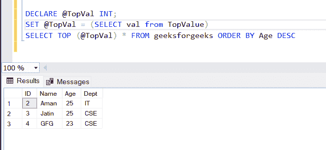

# SQL 使用带有 TOP 的 ORDER BY 根据列的值返回前 X 行

> 原文:[https://www . geesforgeks . org/SQL-按使用顺序逐行逐列逐列逐列逐列逐列逐列逐列逐列逐列逐列逐列逐列逐列逐列逐列逐列逐列逐列逐列逐列逐列逐列逐列逐列逐列逐列逐列逐列逐列逐列逐列逐列逐列逐列逐列逐列逐列逐列逐列逐列](https://www.geeksforgeeks.org/sql-use-order-by-with-top-to-return-the-top-x-rows-based-on-a-columns-value/)

在本文中，我们将学习如何使用带有 TOP 的 [ORDER BY](https://www.geeksforgeeks.org/sql-order-by/) 根据一列的值返回前 x 行。我们将使用另一个表来获取顶值，并在另一个表中使用该值。

所以首先我们创建一个数据库。

**步骤 1:** 创建数据库

```sql
CREATE DATABASE GFG
```

**步骤 2:** 使用该数据库

```sql
USE GFG
```

**步骤 3:** 创建一个表来存储顶值

我们将创建一个存储顶值的表，这样我们就可以用它从另一个表中获取值

```sql
CREATE TABLE TopValue(
 val varchar (255)
)
```

在此表中插入一些顶值数据

```sql
INSERT INTO TopValue VALUES(3) 
```

**第 4 步:**创建要提取的数据表

现在我们将创建一个表，该表的数据将被提取并将填充虚拟数据

```sql
CREATE TABLE geeksforgeeks(
    ID INT,
    Name varchar(255)
    Age varchar(5),
    Dept varchar(255)
    ) 
```

在这个表中插入一些数据，这样我们就可以获取这些数据

```sql
INSERT INTO [dbo].[geeksforgeeks]
           ([ID]
           ,[Name]
           ,[Age]
           ,[Dept])
     VALUES (1, 'Devesh', 21, 'CSE')
GO

INSERT INTO [dbo].[geeksforgeeks]
           ([ID]
           ,[Name]
           ,[Age]
           ,[Dept])
     VALUES (2, 'Aman', 25, 'IT')
GO

INSERT INTO [dbo].[geeksforgeeks]
           ([ID]
           ,[Name]
           ,[Age]
           ,[Dept])
     VALUES (3, 'Jatin', 25, 'CSE')
GO

INSERT INTO [dbo].[geeksforgeeks]
           ([ID]
           ,[Name]
           ,[Age]
           ,[Dept])
     VALUES (4, 'GFG', 23, 'CSE')
GO

INSERT INTO [dbo].[geeksforgeeks]
           ([ID]
           ,[Name]
           ,[Age]
           ,[Dept])
     VALUES (5, 'Para', 22, 'CSE')
GO
```

**步骤 5:** 现在根据另一个表值获取顶部数据

```sql
DECLARE @TopVal INT;
SET @TopVal = (SELECT val from TopValue)
SELECT TOP (@TopVal) * FROM geeksforgeeks ORDER BY Age DESC
```

**输出:**



我们可以看到，数据是根据另一个表中的顶值成功获取的，并按年龄降序排列。