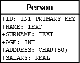

# 使用 C/C++和 SQLite 的 SQLite】

> 原文:[https://www.geeksforgeeks.org/sql-using-c-c-and-sqlite/](https://www.geeksforgeeks.org/sql-using-c-c-and-sqlite/)

在这篇文章中，我们想介绍一下关于 **SQLITE** 结合 **C++** 或者 **C** 的文章。
在继续本教程之前，我们需要遵循 **SQLITE3 安装**的程序，在这里 可以轻松找到 **[。同时要求具备 **SQL** 的基础知识。](https://www.geeksforgeeks.org/introduction-to-sqlite/)**

我们将展示以下操作:

***   Database connection/creation*   Create table*   insert*   delete*   select**

为了简单起见，让我们使用一个仅由一个表组成的简单数据库。


**数据库连接/创建表**

在这个片段中，我们将使用包含在 **sqlite3.h** 库中的两个例程。

```sql
- sqlite3_open(const char *filename, sqlite3 **ppDb)
- sqlite3_close(sqlite3 *ppDb)

```

编译通过添加命令**-SQL lite 3**来执行。

```sql
#include <iostream>
#include <sqlite3.h>

int main(int argc, char** argv)
{
    sqlite3* DB;
    int exit = 0;
    exit = sqlite3_open("example.db", &DB);

    if (exit) {
        std::cerr << "Error open DB " << sqlite3_errmsg(DB) << std::endl;
        return (-1);
    }
    else
        std::cout << "Opened Database Successfully!" << std::endl;
    sqlite3_close(DB);
    return (0);
}
```

输出:

```sql
$ g++ createDB.cpp -l sqlite3
$ ./a.out

Opened Database Successfully!

$ ls
create.cpp
a.out
example.db

```

第一个例程返回一个整数:如果整数等于 0，它成功了。如果数据库还不存在，它将在执行该过程的同一目录中创建。
第二个只是关闭了之前 **SQLITE3_OPEN()** 打开的连接。
所有准备好的与连接相关的声明应在关闭连接之前完成。

**创建表格**

在这个片段中，我们将使用例程:

```sql
- sqlite3_exec(sqlite3*, const char *sql, sqlite_callback, void *data, char **errmsg)

```

```sql
#include <iostream>
#include <sqlite3.h>

int main(int argc, char** argv)
{
    sqlite3* DB;
    std::string sql = "CREATE TABLE PERSON("
                      "ID INT PRIMARY KEY     NOT NULL, "
                      "NAME           TEXT    NOT NULL, "
                      "SURNAME          TEXT     NOT NULL, "
                      "AGE            INT     NOT NULL, "
                      "ADDRESS        CHAR(50), "
                      "SALARY         REAL );";
    int exit = 0;
    exit = sqlite3_open("example.db", &DB);
    char* messaggeError;
    exit = sqlite3_exec(DB, sql.c_str(), NULL, 0, &messaggeError);

    if (exit != SQLITE_OK) {
        std::cerr << "Error Create Table" << std::endl;
        sqlite3_free(messaggeError);
    }
    else
        std::cout << "Table created Successfully" << std::endl;
    sqlite3_close(DB);
    return (0);
}
```

输出:

```sql
$ g++ createTable.cpp -l sqlite3
$ ./a.out

Table created Successfully

```

这个例程返回一个整数:如果这个整数等于 **SQLITE_OK** 宏，那么一切正常。
在这个例子中，省略了关于打开数据库的控件，这些控件是在过去的代码中编写的。

**插入和删除**

我们也将使用 **SQLITE3_EXEC()** 例程进行插入。程序和检查与前一个相似。我们和 **SQLITE3_EXEC()** 使用的字符串只有一个不同。

```sql
#include <iostream>
#include <sqlite3.h>
#include <string>

using namespace std;

static int callback(void* data, int argc, char** argv, char** azColName)
{
    int i;
    fprintf(stderr, "%s: ", (const char*)data);

    for (i = 0; i < argc; i++) {
        printf("%s = %s\n", azColName[i], argv[i] ? argv[i] : "NULL");
    }

    printf("\n");
    return 0;
}

int main(int argc, char** argv)
{
    sqlite3* DB;
    char* messaggeError;
    int exit = sqlite3_open("example.db", &DB);
    string query = "SELECT * FROM PERSON;";

    cout << "STATE OF TABLE BEFORE INSERT" << endl;

    sqlite3_exec(DB, query.c_str(), callback, NULL, NULL);

    string sql("INSERT INTO PERSON VALUES(1, 'STEVE', 'GATES', 30, 'PALO ALTO', 1000.0);"
               "INSERT INTO PERSON VALUES(2, 'BILL', 'ALLEN', 20, 'SEATTLE', 300.22);"
               "INSERT INTO PERSON VALUES(3, 'PAUL', 'JOBS', 24, 'SEATTLE', 9900.0);");

    exit = sqlite3_exec(DB, sql.c_str(), NULL, 0, &messaggeError);
    if (exit != SQLITE_OK) {
        std::cerr << "Error Insert" << std::endl;
        sqlite3_free(messaggeError);
    }
    else
        std::cout << "Records created Successfully!" << std::endl;

    cout << "STATE OF TABLE AFTER INSERT" << endl;

    sqlite3_exec(DB, query.c_str(), callback, NULL, NULL);

    sql = "DELETE FROM PERSON WHERE ID = 2;";
    exit = sqlite3_exec(DB, sql.c_str(), NULL, 0, &messaggeError);
    if (exit != SQLITE_OK) {
        std::cerr << "Error DELETE" << std::endl;
        sqlite3_free(messaggeError);
    }
    else
        std::cout << "Record deleted Successfully!" << std::endl;

    cout << "STATE OF TABLE AFTER DELETE OF ELEMENT" << endl;
    sqlite3_exec(DB, query.c_str(), callback, NULL, NULL);

    sqlite3_close(DB);
    return (0);
}
```

输出:

```sql
$ g++ insertDelete.cpp -l sqlite3
$ ./a.out
STATE OF TABLE BEFORE INSERT
Records created Successfully!
STATE OF TABLE AFTER INSERT
ID = 1
NAME = STEVE
SURNAME = GATES
AGE = 30
ADDRESS = PALO ALTO
SALARY = 1000.0

ID = 2
NAME = BILL
SURNAME = ALLEN
AGE = 20
ADDRESS = SEATTLE
SALARY = 300.22

ID = 3
NAME = PAUL
SURNAME = JOBS
AGE = 24
ADDRESS = SEATTLE
SALARY = 9900.0

Record deleted Successfully!
STATE OF TABLE AFTER DELETE OF ELEMENT
ID = 1
NAME = STEVE
SURNAME = GATES
AGE = 30
ADDRESS = PALO ALTO
SALARY = 1000.0

ID = 3
NAME = PAUL
SURNAME = JOBS
AGE = 24
ADDRESS = SEATTLE
SALARY = 9900.0

```

**选择**

在我们继续展示 Select 操作之前，我们不妨考虑一下所有教程中最重要的一个，让我们看看我们将在示例中使用的**回调**原型。
这个操作让我们从选择操作中获得一个输出:

```sql
typedef int (*sqlite3_callback)(
   void*,    /* Data provided in the 4th argument of sqlite3_exec() */
   int,      /* The number of columns in row */
   char**,   /* An array of strings representing fields in the row */
   char**    /* An array of strings representing column names */
);

```

现在，我们将在选择中使用回调函数，如下面的代码片段所示:

```sql
#include <iostream>
#include <sqlite3.h>

using namespace std;

static int callback(void* data, int argc, char** argv, char** azColName)
{
    int i;
    fprintf(stderr, "%s: ", (const char*)data);

    for (i = 0; i < argc; i++) {
        printf("%s = %s\n", azColName[i], argv[i] ? argv[i] : "NULL");
    }

    printf("\n");
    return 0;
}

int main(int argc, char** argv)
{
    sqlite3* DB;
    int exit = 0;
    exit = sqlite3_open("example.db", &DB);
    string data("CALLBACK FUNCTION");

    string sql("SELECT * FROM PERSON;");
    if (exit) {
        std::cerr << "Error open DB " << sqlite3_errmsg(DB) << std::endl;
        return (-1);
    }
    else
        std::cout << "Opened Database Successfully!" << std::endl;

    int rc = sqlite3_exec(DB, sql.c_str(), callback, (void*)data.c_str(), NULL);

    if (rc != SQLITE_OK)
        cerr << "Error SELECT" << endl;
    else {
        cout << "Operation OK!" << endl;
    }

    sqlite3_close(DB);
    return (0);
}
```

输出:
$ g++ select . CPP-l SQLite 3
$。/a.out

```sql
Opened Database Successfully!
RESULT OF SELECT
ID = 1
NAME = STEVE
SURNAME = GATES
AGE = 30
ADDRESS = PALO ALTO
SALARY = 1000.0

ID = 3
NAME = PAUL
SURNAME = JOBS
AGE = 24
ADDRESS = SEATTLE
SALARY = 9900.0

Operation OK!

```

本文提供了使用 C++/C 使用 SQLITE3 的数据库的快速指南。
在我们的示例中，我们使用了 C++，但是当我们传递字符串时，我们调用了 **c_str()** 方法，以便转换字符数组中的字符串:这证明了所有使用的例程也可以在 C 中使用。

这篇文章是与那不勒斯帕台农神庙大学科技系的学生维托里奥·特里亚西合作撰写的。