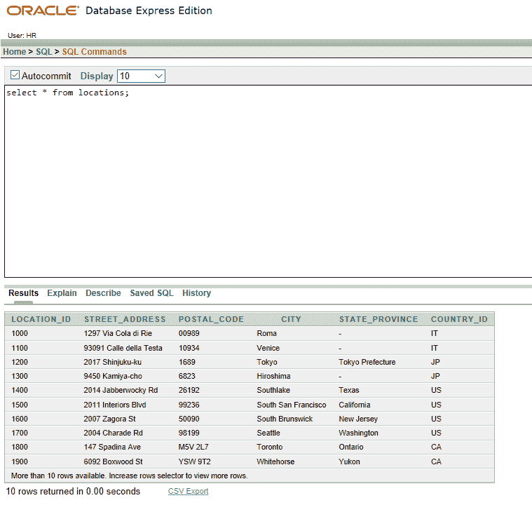

# SQL | USING 子句

> 原文:[https://www.geeksforgeeks.org/sql-using-clause/](https://www.geeksforgeeks.org/sql-using-clause/)

如果几个列具有相同的名称，但是数据类型不匹配，[自然连接](https://www.geeksforgeeks.org/extended-operators-in-relational-algebra/)子句可以用**使用**子句来修改，以指定应该用于[等连接](https://www.geeksforgeeks.org/extended-operators-in-relational-algebra/)的列。

*   当多列匹配时，USING 子句仅用于匹配一列。
*   自然连接和使用条款是互斥的。
*   在引用的列中不应有限定符(表名或别名)。
*   自然连接使用所有具有匹配名称和数据类型的列来连接表。USING 子句只能用于指定那些应该用于 EQUIJOIN 的列。

**示例:**

 ***我们将在以下基表上应用下面提到的命令:*** 


员工表


部门表

**QUERY 1:** 写 SQL 查询找到员工的工作地点。还要给出他们各自的雇员 id 和姓氏？

```sql

Input : SELECT e.EMPLOYEE_ID, e.LAST_NAME, d.LOCATION_ID
FROM Employees e JOIN Departments d
USING(DEPARTMENT_ID);
Output :

```

**说明:**所示示例将 EMPLOYEES 和 DEPARTMENTS
表中的 DEPARTMENT_ID 列连接起来，从而显示了员工的工作地点。

***我们将在以下基表上应用下面提到的命令:***


国家表



位置表

**QUERY 2:** 写 SQL 查询找到 location_id、street_address、postal_code 以及它们各自的国家名称？

```sql

Input : SELECT l.location_id, l.street_address, l.postal_code, c.country_name
FROM locations l JOIN countries c
USING(country_id);
Output : 

```

**说明:**所示示例将 LOCATIONS 和 COUNTRY
表中的 COUNTRY_ID 列连接起来，从而显示了所需的详细信息。

***注意:当我们在联接语句中使用 USING 子句时，联接列不能用 table Alias 限定。即使在 SQL 语句的其他地方使用了相同的列，也不要对其进行别名化:***

**示例:**

```sql
Input: SELECT l.location_id, l.street_address, l.postal_code, c.country_name
FROM locations l JOIN countries c
USING(country_id)
WHERE c.country_id'IT';
Output: 

```

**解释:**由于 USING 子句中的列在 WHERE 子句中被再次使用，因此它会向用户抛出一个错误。