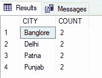

# SQL–使用 GROUP BY 计算一列中每个唯一条目的行数

> 原文:[https://www . geeksforgeeks . org/SQL-使用逐组计数每一列中唯一条目的行数/](https://www.geeksforgeeks.org/sql-using-group-by-to-count-the-number-of-rows-for-each-unique-entry-in-a-column/)

在本文中，我们将看到如何使用 GROUP BY 来计算给定表中每个唯一条目的行数。使用 COUNT，不带 GROUP BY 子句将返回表中存在的行数的总数。

添加 [GROUP BY](https://www.geeksforgeeks.org/sql-group-by/) ，我们可以计算列中每个唯一值的总出现次数。

现在，按照以下步骤进行演示:

**步骤 1:** 创建数据库

我们可以使用以下命令创建一个名为 geeks 的数据库。

**查询:**

```
CREATE DATABASE geeks;
```

**第二步**:使用数据库

使用下面的 SQL 语句将数据库上下文切换到极客:

```
USE geeks;
```

**步骤 3:** 表格定义

我们的极客数据库中有以下演示表。

**查询:**

```
CREATE TABLE demo_table(
NAME VARCHAR(20),
AGE int,
CITY VARCHAR(10));
```

**步骤 4:** 将数据插入表格

**查询:**

```
INSERT INTO demo_table VALUES ('Romy',23,'Delhi'),
('Pushkar',23,'Delhi'),
('Nikhil',24,'Punjab'),
('Rinkle',23,'Punjab'),
('Samiksha',23,'Banglore'),
('Ashtha',24,'Banglore'),
('Satish',30,'Patna'),
('Girish',30,'Patna');
```

**第五步:**查看内容

执行以下查询查看表格的内容

```
SELECT * FROM demo_table;
```

**输出:**


**第 6 步:**使用不带 ORDER BY 语句的计数

*   COUNT(*)对所有行进行计数
*   COUNT(列名)只计算指定列名中的非空值。

**语法(计算所有行):**

```
SELECT COUNT(*)
FROM table_name;
```

**查询:**

```
SELECT COUNT(*) FROM demo_table;
```


**输出:**


结果是 8，因为我们的 demo_table 中有 8 个条目。

**步骤 7:** 使用分组依据

*   用于计算年龄列中的唯一值。

**查询:**

```
SELECT AGE, COUNT(*) as COUNT from demo_table GROUP BY AGE;
```

**输出:**


*   用于计算“城市”列中的唯一值。

```
SELECT CITY,COUNT(*) as COUNT from demo_table GROUP BY CITY;
```


**输出:**

