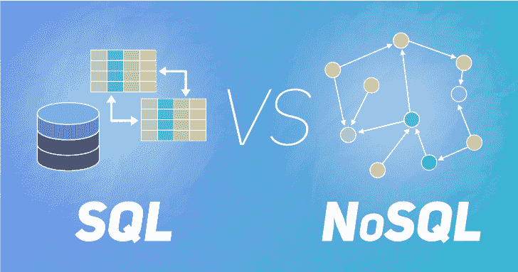
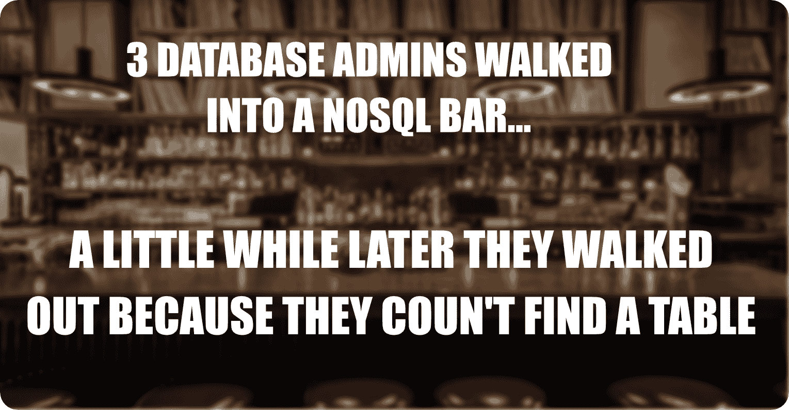

# SQL vs NoSQL:用哪个比较好？

> 原文:[https://www . geesforgeks . org/SQL-vs-no SQL-哪个更好用/](https://www.geeksforgeeks.org/sql-vs-nosql-which-one-is-better-to-use/)

生存还是毁灭:这是个问题！

莎士比亚写这一行的时候可能并没有考虑数据库，但这仍然是目前大多数公司面临的关键问题。在选择数据库时，最大的决定是选择关系数据库(SQL)或非关系数据库(NoSQL)。虽然关系数据库在大多数情况下是一个可行的选择，但它不适合大型数据集和大数据分析。这是 NoSQL 数据库系统在主要互联网公司如*谷歌*、*雅虎*、*亚马逊*等流行的主要原因。

但是**选择数据库的决定并没有**那么简单(到底是什么？！！).SQL 和 NoSQL 数据库都有不同的结构和不同的数据存储方法。因此，在 SQL 和 NoSQL 之间的选择本质上归结为特定项目所需的数据库类型。

### 有什么不同？

SQL 和 NoSQL 数据库都有相同的目的，即存储数据，但它们的方式却大相径庭。SQL 和 NoSQL 数据库之间有许多不同之处，为了对所需的数据库类型做出明智的选择，理解它们是很重要的。

请记住，SQL 和 NoSQL 数据库之间的一些重要区别如下:

### 1.语言:

让我们想象一下，在数据库世界中，每个人都说 X 语言。所以如果你在这中间开始说 Y 语言，那将会非常混乱。SQL 数据库就是这种情况。SQL 数据库基于 SQL 操作数据，SQL 是最通用和最广泛使用的语言选项之一。虽然这使得它成为一个安全的选择，尤其是对于复杂的查询，但它也可能是限制性的。这是因为它需要在使用数据之前使用预定义的模式来确定数据的结构，而更改结构可能会非常混乱(就像使用 Y 语言一样)。

现在再想象一个使用多种语言的数据库世界。虽然这个世界会有点混乱，但说 Y 语言会很好，因为你一定会找到一个白痴同伴！这是一个 NoSQL 数据库，具有非结构化数据的动态模式。在这里，数据以多种方式存储，这意味着它可以是面向文档的、面向列的、基于图的等等。这种灵活性意味着可以在没有定义结构的情况下创建文档，因此每个文档都可以有自己独特的结构。

### 2.可量测性

想想你家附近的一栋高楼。如果可以选择，是在这栋楼里增加更多的楼层，还是为更多的居民建造一栋全新的大楼？

这是 SQL 和 NoSQL 数据库的问题。SQL 数据库是可垂直扩展的。这意味着单个服务器上的负载可以通过增加内存、中央处理器或固态硬盘来增加。(本建筑可增加更多楼层)。另一方面，NoSQL 数据库是可横向扩展的。这意味着可以通过分片或在 NoSQL 数据库中添加更多服务器来处理更多流量。(小区可以增加更多的建筑)。

从长远来看，增加更多的建筑比楼层更好，因为这样更稳定(建造比萨斜塔的机会更小！！！).因此，NoSQL 最终可以变得更大、更强大，使 NoSQL 数据库成为大型或不断变化的数据集的首选。

### 3.模式设计

模式指的是数据库的蓝图，即数据是如何组织的。SQL 数据库和 NoSQL 数据库的模式明显不同。让我们用一个笑话来更好地理解这一点。

这基本上意味着可怜的数据库管理员在 NoSQL 找不到表，因为 NoSQL 数据库没有标准的模式定义。根据需求，它们可以是键值对、基于文档的、图形数据库或宽列存储。另一方面，如果那些数据库管理员去了一个 SQL 栏，他们肯定会发现表，因为 SQL 数据库有一个基于表的模式。

这种模式上的差异使得关系型 SQL 数据库成为需要多行事务的应用程序(如会计系统)或为关系结构构建的遗留系统的更好选择。然而，NoSQL 数据库更适合大数据，因为灵活性是一个重要的要求，它的动态模式满足了这一要求。

### 4.社区

SQL 是一个成熟的技术(*就像你的老但是很有智慧的大叔*)并且有很多有经验的开发人员了解它。此外，供应商对所有 SQL 数据库都提供了强大的支持。甚至有很多独立顾问可以帮助 SQL 数据库进行非常大规模的部署。

另一方面，NoSQL 是比较新的(*年轻有趣的表哥！*)因此一些 NoSQL 数据库依赖社区支持。此外，只有有限的外部专家可用于设置和部署大规模 NoSQL 部署。

### 大问题！！！

与 SQL 相比，NoSQL 是一项新技术。因此，自然会有很多关于 it 的问题，尤其是在大数据和数据分析的背景下。与此相关的一些主要问题如下:

### NoSQL 比 SQL 快吗？

总的来说，NoSQL 并不比 SQL 快，正如 SQL 并不比 NoSQL 快一样。对于那些没有得到该语句的人来说，这意味着速度作为 SQL 和 NoSQL 数据库的一个因素取决于上下文。

SQL 数据库是规范化的数据库，其中数据被分解成各种逻辑表，以避免数据冗余和数据重复。在这种情况下，SQL 数据库在连接、查询、更新等方面比 NoSQL 数据库更快。

另一方面，NoSQL 数据库是专门为非结构化数据设计的，这些数据可以是面向文档的、面向列的、基于图形的等等。在这种情况下，特定的数据实体被存储在一起，而不是被分区。因此，与 SQL 数据库相比，对单个数据实体执行读或写操作对 NoSQL 数据库来说更快。

### NoSQL 更适合大数据应用吗？

他们说“需要是发明之母！“在 NoSQL 的情况下，这肯定是真的。NoSQL 大数据数据库是由谷歌、雅虎、亚马逊等顶级互联网公司专门开发的。因为现有的关系数据库不能应付日益增长的数据处理需求。

NoSQL 数据库有一个更适合大数据的动态模式，因为灵活性是一个重要的要求。此外，大量分析数据可以存储在 NoSQL 数据库中，用于预测分析。这方面的一个例子是来自各种社交媒体网站的数据，如 Instagram、推特、脸书等。NoSQL 数据库可以横向扩展，如果需要，最终可以变得更大、更强大。所有这些都使得 NoSQL 数据库成为大数据应用的首选。

### 最后是结论！！！

SQL 和 NoSQL 之间的选择完全取决于个人情况，因为它们都有优点也有缺点。长期以来，SQL 数据库都是用固定的模式设计和固定的结构建立的。它们非常适合需要多行事务的应用程序，如会计系统或为关系结构构建的遗留系统。

另一方面，NoSQL 数据库易于扩展、灵活且易于使用，因为它们没有严格的模式。它们非常适合没有特定模式定义的应用程序，如内容管理系统、大数据应用程序、实时分析等。