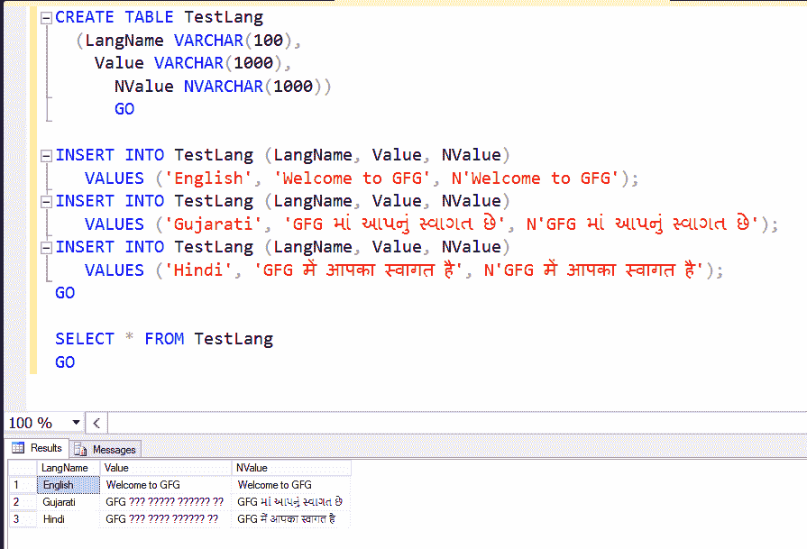

# 在表中存储非英语字符串–在 SQL SERVER 中存储 Unicode 字符串

> 原文:[https://www . geesforgeks . org/storing-a-非英语-表中字符串-unicode-SQL-strings-server/](https://www.geeksforgeeks.org/storing-a-non-english-string-in-table-unicode-strings-in-sql-server/)

在本文中，我们将借助一个示例来讨论在表中存储非英语字符串、在 SQL SERVER 中存储 Unicode 字符串的概述，在该示例中，我们将看到如何用不同的语言存储值，最后将得出如下结论。

**简介:**
[SQL Server](https://www.geeksforgeeks.org/sql-server-identity/) 使用英语作为数据库的默认语言，有人想使用其他语言(如印地语、古吉拉特语等)。)SQL Server 表中的单词。每当我们需要使用另一种语言的 SQL Server 时，我们必须为列使用数据类型 **NVARCHAR** 。如果我们不使用数据类型 NVARCHAR，我们将无法存储非英语值。

**示例:**
在本例中，您将看到如何在数据库中存储不同语言的值。首先，我们将创建一个如下所示的表。

**创建表-TestLang–**
让我们创建一个名为“TestLang”的表。

```sql
CREATE TABLE TestLang  
  (
  LangName VARCHAR(100),
  Value VARCHAR(1000),
  NValue NVARCHAR(1000)
  )
GO
```

**插入数据–**
现在，在表格中插入不同语言的数据，如下所示。

```sql
INSERT INTO TestLang (LangName, Value, NValue)
VALUES ('English', 'Welcome to GFG', N'Welcome to GFG');

INSERT INTO TestLang (LangName, Value, NValue)
VALUES ('Gujarati', 'GFG માં આપનું સ્વાગત છે', N'GFG માં આપનું સ્વાગત છે');

INSERT INTO TestLang (LangName, Value, NValue)
VALUES ('Hindi', 'GFG में आपका स्वागत है', N'GFG में आपका स्वागत है');

GO
```

**验证数据–**
从表格中选择数据，如下所示。

```sql
SELECT *
FROM TestLang
GO
```

**输出:**

<figure class="table">【nvalue】？？？？？？？？？？？？？？？

| 【语言名称】 | 【价值】 |
| --- | --- |
| [gfg] [Chinese] | 【gfg】？？？？？？？？？？？？？？？ | 【gfg】 | 【T410】 |

</figure>

**SQL Server 管理工作室输出:**
可以看到下面给出的截图来看输出来自 SQL Server 管理工作室如下。



**结论:**
从上面的输出，我们可以观察到，当我们有 Unicode 数据类型时，我们能够存储非英语字符串。当列条目中的数据大小差异很大，并且字符串长度可能大于 4，000 字节对时，建议使用 NVARCHAR。