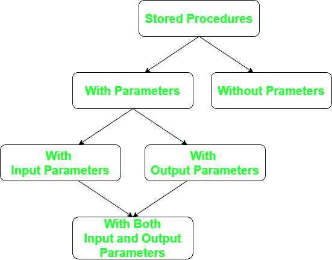

# 基于 SQL Server 中输入和输出参数的存储过程分类

> 原文:[https://www . geesforgeks . org/strored-procedures-class-based-on-input-and-output-parameters-in-SQL-server/](https://www.geeksforgeeks.org/strored-procedures-classification-based-on-input-and-output-parameters-in-sql-server/)

**存储过程:**

存储过程有以下要点。

1.  它是 [SQL](https://www.geeksforgeeks.org/sql-tutorial/) 语句的集合，例如如果您想从[数据库](https://www.geeksforgeeks.org/introduction-of-dbms-database-management-system-set-1/)中写入和读取数据，那么您可以使用 create for write 语句和 select 语句从数据库中读取数据，并将其编译和存储在数据库中。
2.  存储过程是一组 [T-SQL (Transact SQL)](https://www.geeksforgeeks.org/difference-between-sql-and-t-sql/) 语句。
3.  如果您有一种情况，您可以一次又一次地编写相同的查询，您可以将该特定查询保存为存储过程，并只通过其名称来调用它。



存储过程的分类

**创建不带参数的存储过程:**

您可以使用下面给出的存储过程创建不带参数的存储过程。

```
create procedure sp_get_empno
as  
begin  
select * from emp where ename='WARD'  
end
exec sp_get_empno
```

**使用输出参数创建存储过程:**

您可以使用下面给出的存储过程来创建带有输出参数的存储过程。

```
declare @empId int
exec GetEmployeeID (@empId int out)
create procedure sp_get_empid(@name varchar(10) out)
as  
begin  
select id from emp where ename="Sam"
end
exec sp_get_empid @empID
```

**使用输入参数**创建 **存储过程**

您可以使用下面给出的存储过程来创建带有输入参数的存储过程。

```
USE Db1
GO
CREATE PROCEDURE dbo.GetEmployeeID(@Email varchar(30))
AS
SELECT *  FROM employeeDetails WHERE email= @Email
GO
```

**使用输入和输出参数创建** **存储过程:**

您可以使用下面给出的存储过程来创建具有输入和输出参数的存储过程。

```
create procedure sp_get_empname(@name varchar(10) out, @id int)
as
begin
select ename from emp where empno=@id
end
declare @en varchar(10)
exec sp_get_empname @en,7521
print @en
```