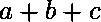
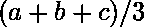

# PL/SQL 中三个数的和与平均值

> 原文:[https://www . geeksforgeeks . org/三进制数的总和与平均值 pl-sql/](https://www.geeksforgeeks.org/sum-and-average-of-three-numbers-in-pl-sql/)

**先决条件**–[PL/SQL 简介](https://www.geeksforgeeks.org/plsql-introduction/)
在 PL/SQL 中，命令的代码组排列在一个块内。一组相关的声明或语句。在声明部分，我们声明变量，在开始和结束部分之间，我们执行操作。

给定三个数字，任务是找出三个数字的和与平均值。
**例:**

```
Input: a = 12, b = 15, c = 32
Output: sum = 59 avg = 19.66

Input: a = 34, b = 45, c = 11
Output: sum = 90 avg = 30

```

**逼近**就是取三个数，用下面给出的公式求它们的和与平均值-
和:
平均值:
其中 a、b、c 是三个数。

以下是所需的实现:

```
--To find sum and avg of three numbers 
DECLARE 

    -- Assigning 12 into a 
    a     NUMBER := 12; 

    -- Assigning 14 into b 
    b     NUMBER := 14; 

    -- Assigning 20 into c 
    c     NUMBER := 20; 

    -- Declare variable for sum  
    -- Of Three number (a, b, c) 
    sumOf3 NUMBER; 

    -- Declare variable for average 
    avgOf3 NUMBER; 

--Start Block 
BEGIN 

    -- Assigning sum of a, b and c into sumOf3 
    sumOf3 := a + b + c; 

    -- Assigning average  of a, b and c into avgOf3 
    avgOf3 := sumOf3 / 3; 

    --print Result  sum of a, b, c number 
    dbms_output.Put_line('Sum = ' 
                         ||sumOf3); 

    --print Average  sum of a, b, c number 
    dbms_output.Put_line('Average = ' 
                         ||avgOf3); 
END; 

--End Program 
```

**输出:**

```
Sum = 46
Average = 15.33

```