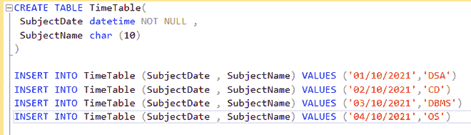
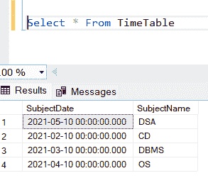

# 更新 SQL Server 中的日期字段

> 原文:[https://www . geesforgeks . org/update-date-in-field-SQL-server/](https://www.geeksforgeeks.org/update-date-field-in-sql-server/)

SQL 中的 UPDATE 语句用于更新数据库中现有表的数据。根据我们的要求，我们可以使用更新语句来更新单列和多列。通过这篇文章，我们将学习如何在 SQL Server 中更新日期字段。在本文中，我们将使用微软的 SQL Server 作为我们的数据库。

因此，我们将首先创建一个数据库:

**步骤 1:** 创建数据库

**查询:**

```sql
CREATE DATABASE GFG
```

**步骤 2:** 使用数据库

**查询:**

```sql
USE GFG
```

**步骤 3:** 创建表格

在数据库中创建一个表(TiME)来存储数据。

**查询:**

```sql
CREATE TABLE TimeTable(
 SubjectDate datetime NOT NULL ,
 SubjectName char (10)
)
```

**步骤 4:** 将数据插入数据库

**查询:**

```sql
/* Data Inserted for a full week dates*/

INSERT INTO TimeTable (SubjectDate , SubjectName) VALUES ('01/10/2021','DSA')
INSERT INTO TimeTable (SubjectDate , SubjectName) VALUES ('02/10/2021','CD')
INSERT INTO TimeTable (SubjectDate , SubjectName) VALUES ('03/10/2021','DBMS')
INSERT INTO TimeTable (SubjectDate , SubjectName) VALUES ('04/10/2021','OS')
```



**步骤 5:** 现在更改日期时间的数据

在查询下方的中， **SET** 语句用于为特定列设置新值，而 **WHERE** 子句用于选择需要更新列的行。如果我们没有使用 WHERE 子句，那么 **中的列和所有** 中的行都将被更新。所以 WHERE 子句用于选择特定的行。

**查询:**

```sql
UPDATE TimeTable   
SET SubjectDate = '05/10/2021'   
WHERE SubjectName = 'DSA'   
```

**输出:**



如我们所见，主题日期已更改。