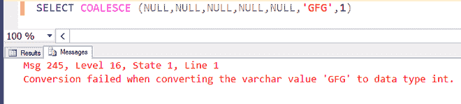

# 在 SQL Server 中使用聚结()函数

> 原文:[https://www . geeksforgeeks . org/use-of-concert-function-in-SQL-server/](https://www.geeksforgeeks.org/use-of-coalesce-function-in-sql-server/)

**简介:**
SQL Server 聚结()函数对于处理 NULL 值非常有用。在表达式值计算过程中，空值被用户给定的值替换。SQL Server 联合函数以确定的顺序计算表达式，并且总是首先从定义的表达式列表中得出非空值。

**语法:**

```
COALESCE ( exv1, exv2..., exvN )

```

**其中–**
ex v1、exv2…、exvN 为表达式值。

**SQL Server 合并函数语法的属性:**

*   所有表达式必须具有相同的数据类型。
*   它可以有多个表达式。

**示例-1 :**

```
SELECT COALESCE (NULL, 'X', 'Y') 
AS RESULT ;
```

**输出:**

| 结果 |
| --- |
| X |

**示例-2 :**

```
SELECT COALESCE (NULL, 13, 24, 35, 46) 
AS RESULT ;
```

**输出:**

| 结果 |
| --- |
| Thirteen |

**示例-3 :**

```
SELECT COALESCE (NULL, NULL, 45, NULL, NULL) 
AS RESULT ;
```

**输出:**

| 结果 |
| --- |
| Forty-five |

**示例-4 :**

```
SELECT COALESCE (NULL, NULL, NULL, NULL, NULL, 'GFG') 
AS RESULT ;
```

**输出:**

| 结果 |
| --- |
| GFG |

**示例-5 :**

选择“合并”(空、空、空、空、5、“GFG”)作为结果；

| 结果 |
| --- |
| five |

**输出:**
当查询在 SQL Server 管理工作室中运行时。


**示例-6 :**

```
SELECT COALESCE 
(NULL, NULL, NULL, NULL, NULL, 'GFG', 1)
```

**输出:**


**在字符串连接操作中使用 SQL Server 聚结函数:**
让我们假设我们有下面的表名“极客名”。

**例-7 :**
**输出:**

```
Select * from GeekName;
```

| F_Name | M_Name | L_Name |
| --- | --- | --- |
| 马诺伊 | 米（meter 的缩写）） | 库马尔 |
| 库希 | 空 | 程序 |
| 帕帕尔 | K. | Chauan |
| 妮莎 | 空 | 笈多王朝 |
| 迈纳 | 空 | 辛格 |
| 基山 | C. | 月亮 |

**示例-8 :**

```
SELECT F_Name + ' ' +M_Name+ ' ' 
+ L_Name FullName FROM GeekName ;
```

**输出:**

| 表 |
| --- |
| 马诺杰·库马尔 |
| 空 |
| 帕帕尔克沙安 |
| 空 |
| 空 |
| 基尚·马安 |

**使用名为**的 SQL server 函数来处理空值:****
SQL 语句将连接所有三个名称，但输出中不会出现空值。

**示例-9 :**

```
SELECT F_Name +' '+COALESCE(M_Name, '') +' '
+ L_Name   FullName  FROM GeekName ;
```

**输出:**

| 表 |
| --- |
| 马诺杰·库马尔 |
| 库希·莫迪 |
| 帕帕尔 |
| 妮莎·古普塔 |
| 米娜·辛格 |
| 基尚·马安 |