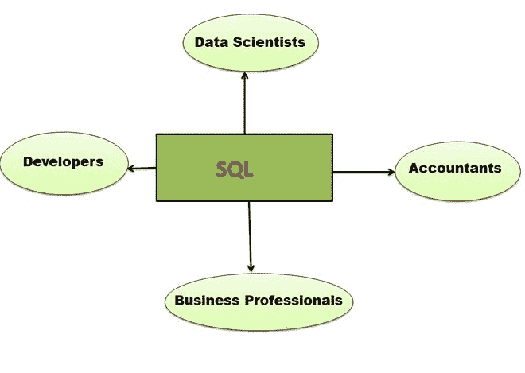
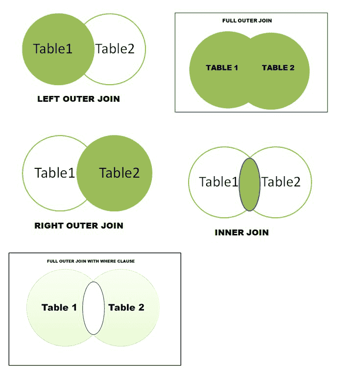

# SQL 的使用

> 原文:[https://www.geeksforgeeks.org/uses-of-sql/](https://www.geeksforgeeks.org/uses-of-sql/)

SEQUEL 广为人知的 SQL，**结构化查询语言**是最流行的数据库标准语言。这是一种特定于领域的语言，主要用于执行大量操作，包括创建数据库、以表格形式存储数据、修改、提取等等。有不同版本的 SQL，如 MYSQL、PostgreSQL、Oracle、SQL lite 等。

SQL 在 1986 年成为美国国家标准协会(ANSI) 的标准，第二年在 1987 年成为 T4 国际标准化组织的标准。今天是互联网和科技的世界。我们被大量的数据包围着。因此为了安全地存储和管理这些数据，我们需要一个合适的数据库，而要管理一个数据库我们需要一种语言，那就是 SQL。它有广泛的应用，被商业专家、开发人员、数据科学家用来维护和操作数据。根据最近 2020-21 年的统计，SQL 仍然是全世界使用最多的语言之一。

现在，我们将讨论 SQL 的动态使用:

**1。关系数据库:**要理解关系数据库，我们首先需要理解**关系模型，缩写为 RM** 。数据库的远程管理就是简单地存储数据，并以一种结构化和特定的方式进行管理。科学家埃德加·科德在 1969 年的《T4》中首次描述了它。在 RM 中，我们以行的形式存储数据，通常称为“*元组”*，这些元组被分组为关系。RM 有助于以描述性和简洁的方式存储数据，这有助于通过简单的查询来检索和操作数据。于是，在 1970 年，Code 推出了一款名为**关系数据库管理系统(RDBMS)** 的软件，用来使用 SQL 维护 RM。SQL 有助于查询和维护关系数据库管理系统中的数据。这是 SQL 语言的主要用途之一，它以查询的形式给关系数据库管理系统下达执行某些任务的命令。

**2。使用 SQL 执行数据库中的所有基本操作:** SQL 有助于执行大量命令，帮助我们在数据库中执行各种操作。它们可以大致分为四类:

*   **数据定义语言:** SQL 有助于建立数据库和表，并执行某些操作，如[**CREATE**](https://www.geeksforgeeks.org/sql-create/)[**ALTER**](https://www.geeksforgeeks.org/sql-alter-add-drop-modify/)[**DROP**](https://www.geeksforgeeks.org/sql-drop-truncate/)[**RENAME**](https://www.geeksforgeeks.org/sql-alter-rename/)[**TRUNCATE**](https://www.geeksforgeeks.org/sql-drop-truncate/)[**COMMENT**](https://www.geeksforgeeks.org/sql-comments/)**。**
*   **数据查询语言:**我们广泛使用命令 [**选择**](https://www.geeksforgeeks.org/sql-select-query/) 从数据库中检索信息。
*   **数据操作语言:** SQL 用于操作数据库中的数据。操作为 [**插入**](https://www.geeksforgeeks.org/sql-insert-statement/) **、** [**更新**](https://www.geeksforgeeks.org/sql-update-statement/) 、和[**删除**](https://www.geeksforgeeks.org/sql-delete-statement/) **。**
*   **数据控制语言:**控制命令如 [**【格兰特】**](https://www.geeksforgeeks.org/dcl-full-form/#:~:text=DCL%20stands%20for%20Data%20Control,tables%2C%20views%2C%20or%20sequences.) 用于授予用户执行特定操作的权限/访问权限。使用 [**撤销**](https://www.geeksforgeeks.org/dcl-full-form/#:~:text=DCL%20stands%20for%20Data%20Control,tables%2C%20views%2C%20or%20sequences.) 从用户处收回访问权。

**3。数据库中的事务控制:** SQL 也用于维护数据库中发生的事务。它包括以下基本规则，以保持数据库的一致性。这些规则被称为 [**酸性属性**](https://www.geeksforgeeks.org/acid-properties-in-dbms/) **。**使用最多的控制命令有[**COMMIT**](https://www.geeksforgeeks.org/sql-transactions/)[**roll back**](https://www.geeksforgeeks.org/sql-transactions/)等。

**4。SQL UNION:** 在关系代数中，我们使用 UNION 运算符将两个集合组合成一个集合，其中包含不同的值。类似地，使用两个不同的 SELECT 语句，SQL [**UNION**](https://www.geeksforgeeks.org/sql-union-clause/) 有助于提供单个结果。两个表的联合给出了两个表中存在的不同属性(列)。

**5。SQL JOIN:** SQL JOIN 语句有助于连接两个或多个表，以便检索信息。**的使用主要是因为在一个数据库中，我们可能有两个或更多的表。例如，有两个表“客户”包含客户信息，“产品”包含产品信息。所以，要知道购买产品的客户详细信息，我们需要 JOIN 操作。JOINS 基本上有四种类型:**

*   **内部连接**
*   **左(外)连接**
*   **右(外)连接**
*   **带 WHERE 子句的完全(外部)连接和完全外部连接**

****

****6。网站上的 SQL:**像 SQL 这样的查询语言主要应用在交互式网站上，这些网站以数据库的形式包含了大量关于用户、产品的信息。每个网站的后端都有一个数据库支持。SQL 主要用于检索和存储这些数据。每个网站都有自己的数据库，里面包含了很多关于用户的信息。该数据库用于检索和存储信息。大部分电商网站、IRCTC、电影预约网站等。根据用户需求，使用嵌入在代码中的查询语言对其数据执行各种操作。**T3】****

****7。兼容性和灵活性:** SQL 与关系数据库兼容，如微软 SQL Server、MS access、Oracle 数据库、MYSQL 等，它还提供了灵活性，并提供了谁可以访问和操作数据库中哪个表的权限。它可以轻松管理网站上发生的大量记录和交易。SQL 中有各种特殊的库，比如 SQLite，它有助于将客户端 web 应用程序连接到开发人员正在使用的数据库，这有助于处理客户端的数据集。**

****8。** **与其他语言的集成:** SQL 与两种著名的脚本语言 [**Python**](https://www.geeksforgeeks.org/sql-using-python/) 和 [**R**](https://www.geeksforgeeks.org/working-with-databases-in-r-programming/#:~:text=R%20can%20be%20connected%20to,to%20visualize%20and%20manipulate%20them.) 轻松集成。集成后，我们可以用这些脚本语言轻松管理数据库。这主要由机器学习工程师、数据分析师、数学家使用，他们一次处理大量统计数据。**

****9。面向数据科学家和分析师的 SQL:**如上所述，脚本语言可以很容易地与 SQL 集成。分析人员在关系数据库中处理大量的数据集，SQL 非常有帮助，因为它可以通过简单的查询来管理更大的数据集。使用 SQL 的一个基本例子是“数据过滤”，其中我们使用带有一些逻辑运算符和条件的“**”子句。我们可以执行其他操作，如切片、索引、聚合等。用数据集。****

******10。SQL for Machine Learning:** 机器学习工程师还会处理大量数据集来构建精确的模型。“没有数据就没有机器学习”。一个很好的例子是谷歌云平台 BigQuery ML。它有助于使用 SQL 中的各种查询和工具创建和执行各种机器学习模型。使用 SQL 的机器学习以及使用 Tensor Flow 与现代脚本语言的集成是处理海量数据的下一件大事。****