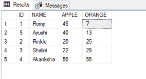

# 使用 CASE in ORDER BY 子句按 SQL 中 2 列的最低值对记录进行排序

> 原文:[https://www . geesforgeks . org/使用按子句排序的大小写来按 sql 中 2 列的最低值对记录进行排序/](https://www.geeksforgeeks.org/using-case-in-order-by-clause-to-sort-records-by-lowest-value-of-2-columns-in-sql/)

在本文中，我们将看到如何在 ORDER BY 子句中使用 CASE，按照 SQL 中 2 列的最低值对记录进行排序。

[案例](https://www.geeksforgeeks.org/sql-case-statement/)陈述:

该语句包含一个或多个条件及其相应的结果。当满足一个条件时，它停止读取，并返回相应的结果(类似于 IF-ELSE 语句)。

如果没有条件为真，它将返回 CASE 语句中 ELSE 子句中指定的值。如果语句中没有 ELSE 子句，它将返回空值。

**案例语法:**

```sql
CASE
   WHEN condition1 THEN result1
   WHEN condition2 THEN result2
   WHEN condition3 THEN result3
   ELSE result
END;
```

[**ORDER BY:**](https://www.geeksforgeeks.org/sql-order-by/) 该关键字用于按升序或降序对结果集进行排序。默认情况下，它按升序对记录进行排序。ASC 或 DESC 是分别按升序或降序对记录进行排序的关键字。

**按语法排序:**

```sql
SELECT column_name1, column_name2, ...
FROM table_name
ORDER BY column_name1, column_name2, ... ASC|DESC;
```

**步骤 1:** 创建数据库

使用下面的 SQL 语句创建一个名为 geeks 的数据库。

**查询:**

```sql
CREATE DATABASE geeks;
```

**步骤 2:** 使用数据库

使用下面的 SQL 语句将数据库上下文切换到极客。

**查询:**

```sql
USE geeks;
```

**步骤 3:** 表格定义

我们的极客数据库中有以下演示表。

**查询:**

```sql
CREATE TABLE demo_table(
ID int,
NAME VARCHAR(20),
APPLE int,
ORANGE int);
```

**步骤 4:** 将数据插入表格

**查询:**

```sql
INSERT INTO demo_table VALUES
(1, 'Romy', 45, 7),
(2, 'Rinkle', 20, 25),
(3,'Shalini', 22, 29),
(4, 'Akanksha',50, 55),
(5,'Ayushi', 40, 13);
```

**第 5 步:使用 ORDER BY 子句中的 CASE 按照 2 列的最低值**对记录进行排序

为了演示，我们将使用“ORANGE”和“APPLE”列的最低值对表格进行排序。

**查询:**

```sql
SELECT * FROM demo_table
ORDER BY CASE  
          WHEN  APPLE< ORANGE THEN APPLE
          ELSE ORANGE
        END
```

**输出:**



**输出说明:**

*   首先是标识=1，因为标识= 1 的橙色列在表中具有最低的记录。
*   ID=5 是第二个，因为 ID=5 的 Orange 列在表中有倒数第二个记录。
*   ID= 2 是第三个，因为如果 ID=2，则 Apple 列在表中具有倒数第三的记录，以此类推。