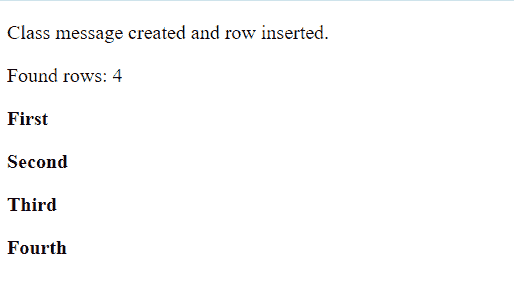
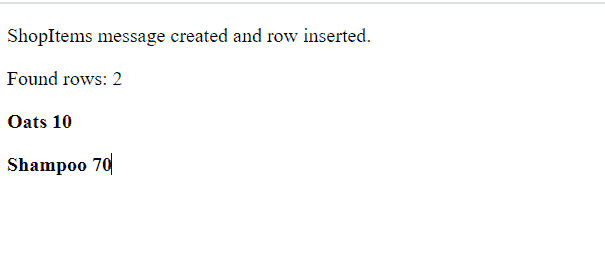

# 什么是 WEB SQL？

> 原文:[https://www.geeksforgeeks.org/what-is-web-sql/](https://www.geeksforgeeks.org/what-is-web-sql/)

**网络 SQL** 是一个**网页应用编程接口**，用于存储或管理数据库中的数据，可以使用 SQL 的变体进行查询，如创建数据库、打开事务、创建表、向表中插入值、删除值和读取数据。

网络数据库应用编程接口不是 HTML5 规范的一部分，但它是一个独立的规范。它指定了一组使用 SQL 操作客户端数据库的应用编程接口。

网络 SQL 数据库在最新版本的 Safari、谷歌 Chrome、安卓浏览器和 Opera 中工作。

### **方法:**

有三种基本方法:

<figure class="table">

| S.No | 方法 | 说明 |
| --- | --- | --- |
| 1. | **打开数据库** | 它可以用于创建新的数据库，也可以使用现有的数据库创建数据库对象。 |
| 2. | **交易** | It 事务可以控制事务，并根据情况执行提交或回滚。 |
| 3. | **执行 Sql** | 它用于执行真实的 SQL 查询。 |

</figure>

### **创建或打开网络 SQL 数据库:**

我们可以使用 **opendatabase** 函数创建一个有四个参数的数据库:

*   数据库名称
*   版本号
*   描述
*   大小
*   创建回调。

创建数据库时会调用创建回调。

使用 *openDatabase* ()方法访问数据库。如果数据库不存在，方法首先创建它，然后打开它:

```
Syntax: var gfgDb = opendatabase(database name, version number, description, size);
```

我们可以通过运行以下查询来创建数据库:

```
var gfgDb = opendatabase('mydb', '1.0', 'this is a client side database', 2 * 1024 * 1024);

//to check whether the database is created or not.
        if (!gfgDb) {
            alert('database not created');
        }
        else {
            var version = gfgDb.version;
        }
```

### **创建交易:**

我们可以从数据库实例中使用名为**事务**的函数。

```
Syntax:
gfgDb.transaction(function (tx) {

            });
```

这里， *gfgDb* 是我们的数据库实例，tx 是我们将要用于即将到来的操作的事务对象。如果任何操作出现错误，交易将被*回滚*。使用事务可以轻松管理错误日志。

### **执行查询:**

要执行查询，可以使用 database.transaction()函数。它只有一个参数，执行如下查询:

```
var gfgDb = openDatabase('mydb', '1.0', 'Test DB', 2 * 1024 * 1024);   

gfgDb.transaction(function (tx) {     
   tx.executeSql('CREATE TABLE IF NOT EXISTS CLASS (id unique, class)');   
});  
```

上面的代码将在“gfgDb”数据库中创建一个名为 CLASS 的表。

### **插入操作:**

按如下方式在表中创建条目

```
var gfgDb = openDatabase('mydb', '1.0', 'Test DB', 2 * 1024 * 1024);  

gfgDb.transaction(function (tx) {  
  tx.executeSql('CREATE TABLE IF NOT EXISTS CLASS (id unique, class)');  
  tx.executeSql('INSERT INTO CLASS (id, class) VALUES (1, "First")');  
  tx.executeSql('INSERT INTO CLASS (id, class) VALUES (2, "Second")');  
}); 
```

*executeSql* 的第二个参数将字段数据映射到查询，如下所示:

```
var id="1";
var text="First";

tx.executeSql('INSERT INTO CLASS (id, text) VALUES (?, ?)', [id, text]);
```

给你。id 和文本是外部变量， *executeSql* 将数组参数中的每个项目映射到“？”南

### **读取操作:**

要读取已经存在的记录，我们使用回调:

```
var gfgDb = openDatabase('mydb', '1.0', 'Test DB', 2 * 1024 * 1024);  

db.transaction(function (tx) { 
   tx.executeSql('CREATE TABLE IF NOT EXISTS CLASS (id unique, class)');
   tx.executeSql('INSERT INTO CLASS (id, class) VALUES (1, "First")'); 
   tx.executeSql('INSERT INTO CLASS (id, class) VALUES (2, "Second")'); 
});  

db.transaction(function (tx) { 
   tx.executeSql('SELECT * FROM CLASS', [], function (tx, results) { 
      var len = results.rows.length, i; 
      msg = "<p>Found rows: " + len + "</p>"; 
      document.querySelector('#status').innerHTML +=  msg; 

      for (i = 0; i < len; i++) { 
         alert(results.rows.item(i).class ); 
      } 

   }, null); 
});
```

回调接收事务对象和结果对象。results 对象包含一个 rows 对象，它有一个长度，但是要到达单独的行，使用 **results.rows.item(i)** ，其中 I 是行的索引。

**例 1:**

## 超文本标记语言

```
<!DOCTYPE HTML>   

<html>    
   <head>   

      <script type = "text/javascript">   
         var gfgDb = openDatabase('mydb', '1.0', 'Test DB', 2 * 1024 * 1024);   
         var msg;   

         gfgDb.transaction(function (tx) {   
            tx.executeSql('CREATE TABLE IF NOT EXISTS CLA (id unique, class,name)');   
            tx.executeSql('INSERT INTO CLA (id, class,name) VALUES (1, "First","Geeks")');   
            tx.executeSql('INSERT INTO CLA (id, class,name) VALUES (2, "Second","Hazel")');  
            tx.executeSql('INSERT INTO CLA (id, class,name) VALUES (3, "Third","Ronaldo")');  
            tx.executeSql('INSERT INTO CLA (id, class,name) VALUES (4, "Fourth","Sachin")');  

            msg = '
<p>Class message created and row inserted.</p>
';   
            document.querySelector('#status').innerHTML =  msg;   
         })  

         gfgDb.transaction(function (tx) {   
            tx.executeSql('SELECT * FROM CLA', [], function (tx, results) {   
               var len = results.rows.length, i;   
               msg = "
<p>Found rows: " + len + "</p>
";   
               document.querySelector('#status').innerHTML +=  msg;   

               for (i = 0; i < len; i++) {   
                  msg = "
<p><b>" + results.rows.item(i).class + "</b></p>
";   
                  document.querySelector('#status').innerHTML +=  msg;   
               }   
            }, null);   
         });   
      </script>   
   </head>   

   <body>   
      <div id = "status" name = "status">Status Message</div>   
   </body>   
</html>  
```

**输出:**



**例 2:**

## 超文本标记语言

```
<!DOCTYPE HTML>   

<html>    
   <head>   

      <script type = "text/javascript">   
         var gfgDb = openDatabase('mydb', '1.0', 'Test DB', 2 * 1024 * 1024);   
         var msg;   

         gfgDb.transaction(function (tx) {   
            tx.executeSql('CREATE TABLE IF NOT EXISTS ShopItems (id unique, item_name, price)');   
            tx.executeSql('INSERT INTO ShopItems (id, item_name, price) VALUES (1, "Oats","10")');   
            tx.executeSql('INSERT INTO ShopItems (id, item_name, price) VALUES (2, "Shampoo","70")');   
            msg = '
<p>ShopItems message created and row inserted.</p>
';   
            document.querySelector('#status').innerHTML =  msg;   
         })  

         gfgDb.transaction(function (tx) {   
            tx.executeSql('SELECT * FROM ShopItems', [], function (tx, results) {   
               var len = results.rows.length, i;   
               msg = "
<p>Found rows: " + len + "</p>
";   
               document.querySelector('#status').innerHTML +=  msg;   

               for (i = 0; i < len; i++) {   
                  msg = "
<p><b>" + results.rows.item(i).item_name +" "+ results.rows.item(i).price + "</b></p>
";   
                  document.querySelector('#status').innerHTML +=  msg;   
               } 

            }, null);   
         });   
      </script>   
   </head>   

   <body>   
      <div id = "status" name = "status">Status Message</div>   
   </body>   
</html>  
```

**输出:**

