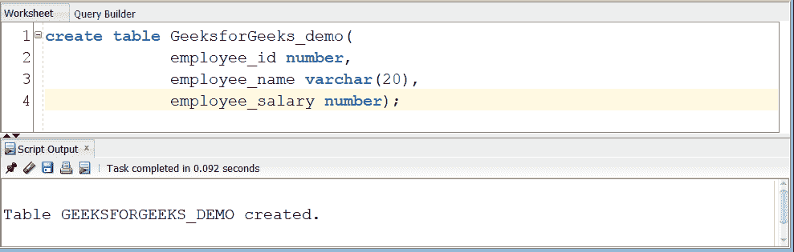
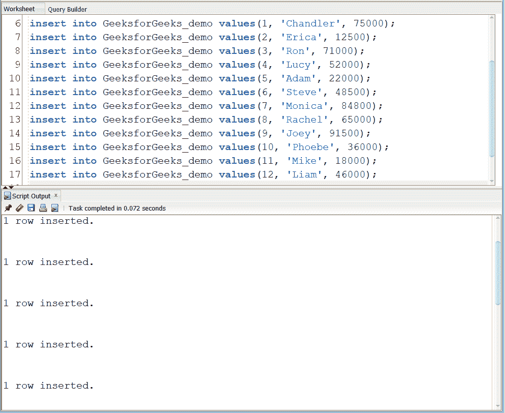
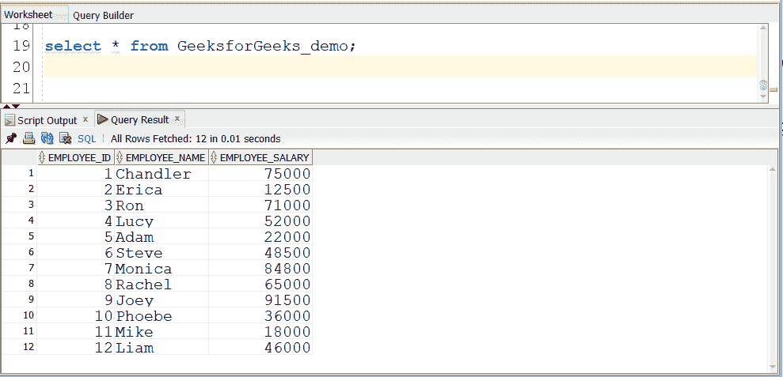
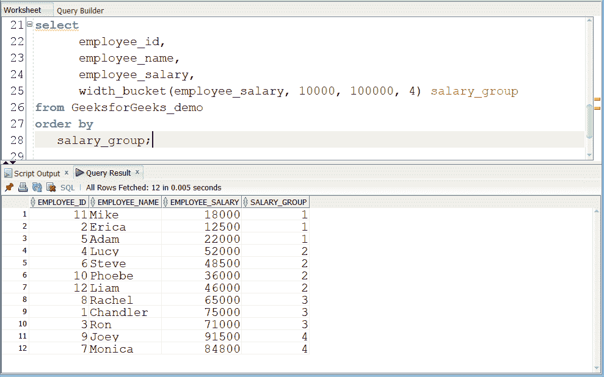

# 甲骨文中的 WIDTH_BUCKET()函数

> 原文:[https://www . geesforgeks . org/width _ bucket-function-in-Oracle/](https://www.geeksforgeeks.org/width_bucket-function-in-oracle/)

**WIDTH_BUCKET( )** 是 Oracle 和 PostgreSQL 中使用的数学函数。顾名思义，width_bucket 意味着将直方图划分为等宽的桶，也就是说每个桶都有一个相等的大小/间隔。该函数接受四个输入，即表达式、表达式的下限、上限和我们想要划分直方图的组数。因此，在处理表达式之后，返回包含所需值的桶号。因此，使用 width_bucket 函数，我们得到一个宽度相等但高度不同的直方图。

width_bucket 函数是一个非常有用的分组函数。

**语法:**

```sql
WIDTH_BUCKET(expression, hist_min_value,
hist_max_value, num_buckets)
```

**参数:**

*   **表达式:**以不同间隔分组的数值表达式。此表达式必须计算数值或日期时间值，或者可以隐式转换为数值或日期时间值的值。该值必须在-(2^53–1)到 2^53–1(含)的范围内。
*   **hist_min_value:** 提供时段下限/最小值的数值或日期时间值表达式。
*   **hist_max_value:** 提供时段上限/最大值的数值或日期时间值表达式。
*   **num _ bucket:**大于 0 的 INTEGER 表达式指定我们要在其中划分表达式的 bucket 数量。

**注意:** MySQL 和 SQL Server 不支持 WIDTH_BUCKET，但 Oracle 和 PostgreSQL 支持 WIDTH_BUCKET 的 ANSI SQL 语法。

现在举个例子，在员工工资列上创建一个四个桶的直方图，工资在 10，000 到 1，000，000 卢比之间。对于集合中的每个值，该函数将桶号返回为–SALES GROUP。

**步骤 1:** 我们创建一个表。我们已经创建了由 3 列组成的表-员工 id、员工姓名和员工工资。为此，我们使用下面的命令创建一个名为 GeeksforGeeks_demo 的表。

**查询:**

```sql
create table geeksforgeeks_demo(employee_id number,
employee_name varchar(20),employee_salary number);
```

**输出:**



**步骤 2:** 这是向表中插入行的查询。

**查询:**

```sql
insert into GeeksforGeeks_demo values(1, 'Chandler', 75000);
insert into GeeksforGeeks_demo values(2, 'Erica', 12500);
insert into GeeksforGeeks_demo values(3, 'Ron', 71000);
insert into GeeksforGeeks_demo values(4, 'Lucy', 52000);
insert into GeeksforGeeks_demo values(5, 'Adam', 22000);
insert into GeeksforGeeks_demo values(6, 'Steve', 48500);
insert into GeeksforGeeks_demo values(7, 'Monica', 84800);
insert into GeeksforGeeks_demo values(8, 'Rachel', 65000);
insert into GeeksforGeeks_demo values(9, 'Joey', 91500);
insert into GeeksforGeeks_demo values(10, 'Phoebe', 36000);
insert into GeeksforGeeks_demo values(11, 'Mike', 18000);
insert into GeeksforGeeks_demo values(12, 'Liam', 46000);
```

**输出:**



**步骤 3:** 查看插入的数据

**查询:**

```sql
select * from GeeksforGeeks_demo;
```

**输出:**



**第四步:**查询表，调用 WIDTH_BUCKET():

**查询:**

```sql
select 
      employee_id,
      employee_name, 
      employee_salary,  
      width_bucket(employee_salary,
       10000, 100000, 4) salary_group
from GeeksforGeeks_demo
order by salary_group;
```

**输出:**

