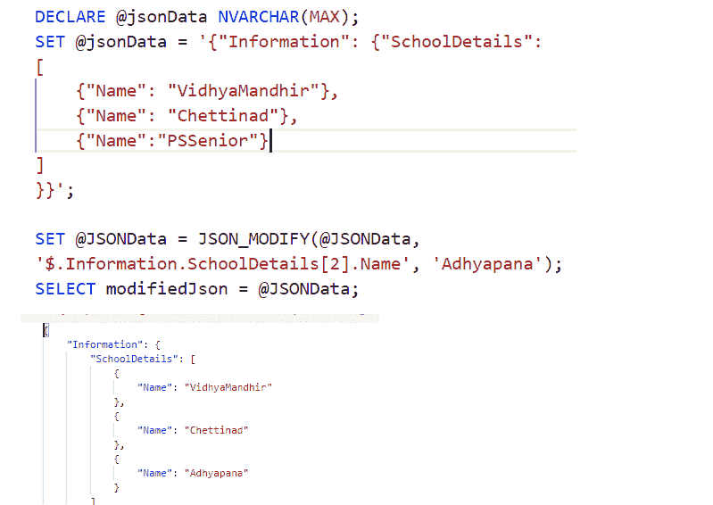

# 在 SQL 中使用 JSON

> 原文:[https://www.geeksforgeeks.org/working-with-json-in-sql/](https://www.geeksforgeeks.org/working-with-json-in-sql/)

**JSON** 代表 **Javascript 对象符号**。它主要用于存储和传输数据。大部分都是 NoSQL 的数据库，比如 MongoDB、CouchDB 等。，使用 JSON 格式的数据。每当您的数据从一个服务器必须转移到一个网页，JSON 格式是首选格式作为前端应用程序，如安卓、iOS、React 或 Angular 等。，可以解析 JSON 内容并根据方便显示。即使在 SQL 中，我们也可以发送 JSON 数据，并且可以轻松地将其存储在行中。让我们一个一个来看。

让我们为 SQL Server 使用 Azure 数据工作室。让我们也创建一个数据库，并准备一个表。然后可以进行 JSON。Azure Data Studio 适用于 Windows 10、Mac 和 Linux 环境。可以从[这里](https://docs.microsoft.com/en-us/sql/azure-data-studio/download-azure-data-studio?view=sql-server-ver15)开始安装。

### **数据库创建:**

命令来创建数据库。这里的 GEEKSFORGEEKS 是数据库的名字。

```
CREATE DATABASE GEEKSFORGEEKS;
```

要激活数据库，请使用以下命令:

```
USE GEEKSFORGEEKS;
```


### 使用数据创建表:

现在让我们创建一个名为“ ***【作者】*** 的表，并让我们向其中插入一些数据，如下所示:

```
CREATE TABLE Authors (
    ID INT IDENTITY NOT NULL PRIMARY KEY,
    AuthorName NVARCHAR(MAX),
    Age INT,
    Skillsets NVARCHAR(MAX),
    NumberOfPosts INT
);
INSERT INTO Authors (AuthorName,Age,Skillsets,NumberOfPosts) VALUES ('Geek',25,'Java,Python,.Net',5);
GO

INSERT INTO Authors (AuthorName,Age,Skillsets,NumberOfPosts) VALUES ('Geek2',22,'Android,Python,.Net',15);
GO
INSERT INTO Authors (AuthorName,Age,Skillsets,NumberOfPosts) VALUES ('Geek3',23,'IOS,GO,R',10);
GO
INSERT INTO Authors (AuthorName,Age,Skillsets,NumberOfPosts) VALUES ('Geek4',24,'Java,Python,GO',5);
GO
```

JSON 是连接 NoSQL 和关系世界的一个很好的选择。因此，如果您有从 MongoDB 导出的数据，并且需要在 SQL Server 中导入它们，我们可以遵循以下方法

JSON 文档可以以 LOB 存储格式或关系存储格式原样存储在 NVARCHAR 列中。原始 JSON 文档必须被解析，它们可能包含非英语文本。通过使用 nvarchar(max)数据类型，我们可以存储最大容量为 2 GB 的 JSON 文档。如果 JSON 数据不庞大，我们可以选择 NVARCHAR(4000)，或者出于性能原因，我们可以选择 NVARCHAR(max)。

### 跨功能兼容性:

将 JSON 文档保持为 NVARCHAR 格式的主要原因是为了跨功能兼容性。NVARCHAR 与 X 特性一起工作，即所有的 SQL 服务器组件，如 Hekaton(OLTP)、时态或列存储表等。因为 JSON 行为也是这样，所以它被表示为 NVARCHAR 数据类型。

### **迁移:**

在 SQL Server 2016 之前，JSON 作为文本存储在数据库中。因此，需要更改数据库模式，并以 NVarchar 格式的 JSON 类型进行迁移

### **客户端支持:**

JSON 在 Javascript 中被视为对象，因此被称为 JavaScript 对象符号。客户端没有类似于 XmlDom 对象的特定标准化 JSON 对象类型。

让我们看看 SQL Server 中可以用于 JSON 数据的重要功能。

【JSON 数据示例:

```
{
"Information": 
  {"SchoolDetails": 
     [{"Name": "VidhyaMandhir"}, {"Name": "Chettinad"}, {"Name":"PSSenior"}]
  }
}
```

### 1. **ISJSON (** JSON **字符串):**

该功能用于检查**给定的输入 json 字符串是否为 JSON 格式**。如果是 JSON 格式，则返回 1 作为输出，否则返回 0。即它以 INT 格式返回 1 或 0。

```
SELECT ISJSON(@JSONData) AS VALIDJSON
```


### **2。JSON_VALUE (** JSON **字符串，路径:**

输出将是给定 JSON 字符串的标量值。JSON 字符串的解析已经完成，有一些特定的格式可以提供路径。例如

*   { content } ' 2019；–引用整个 JSON 对象
*   $ . example 1 '–JSON 对象中的引用示例 1
*   $[4]'–引用 JSON 数组中的第 4 个元素
*   $ . example 1 . example 2[2]. example 3 '–引用 JSON 对象中的嵌套属性

**示例:**

```
SELECT JSON_VALUE(@JSONData,'$.Information.SchoolDetails[0].Name') as SchoolName
```


**3。JSON_QUERY(** JSON **字符串，路径)**

用于从 JSON 字符串中提取数据或对象的数组。

```
SELECT JSON_QUERY(@JSONData,'$.Information.SchoolDetails')
AS LISTOFSCHOOLS
```


通过 JSON_QUERY 查询学校列表

### **4。JSON_MODIFY:**

(Transact-SQL)函数中有一个名为“JSON_MODIFY”的选项，可用于更新 JSON 字符串中的属性值，并返回更新后的 JSON 字符串。每当需要更改 JSON 文本时，我们都可以这样做

```
SET @JSONData= JSON_MODIFY(@JSONData, '$.Information.SchoolDetails[2].Name', 'Adhyapana');
SELECT modifiedJson = @JSONData;
```



### **5。对于 JSON :**

该函数用于将 SQL Server 数据导出为 JSON 格式。这是一个将 SQL 数据导出为 JSON 格式的有用函数。对于 JSON，有两种选择

*   **自动:**由于是嵌套的，JSON 子数组是基于表层次结构创建的。
*   **PATH:** 通过使用这个我们可以定制的方式定义 JSON 的结构。


作者表输出

```
SELECT * FROM Authors FOR JSON AUTO;
```


```
SELECT * FROM Authors FOR JSON AUTO, ROOT ('AuthorInfo')
```


### **6.开张 ：**

该函数用于将 JSON 作为字符串数据导入。我们可以通过使用 OPENROWSET 函数将 JSON 作为文本文件导入，并且应该启用 BULK 选项。它返回一个以 BulkColumn 作为列名的字符串字段。

**示例:**

```
DECLARE @JSON VARCHAR(MAX)
--Syntax to get json data using OPENROWSET  
SELECT @JSON = BulkColumn FROM OPENROWSET  
(BULK '<pathname\jsonfilename with .json extension>', SINGLE_CLOB)  AS j
--To check  json valid or not, we are using this ISJSON
SELECT ISJSON(@JSON)
--If ISJSON is true, then display the json data
If (ISJSON(@JSON)=1)
SELECT @JSON AS 'JSON Text'
```


**注意:**即使是大数据也可以放置。作为示例，我们只显示了一行。

SINGLE_BLOB，它将文件读取为 varbinary(最大值)。SINGLE_NCLOB，将文件读取为 nvarchar(最大值)—如果内容为非英语文本，如日语或中文等。，数据，我们需要按照这个模式走。我们使用了 SINGLE_CLOB，它将文件读取为 varchar(max)。

它将生成一个关系表，其内容来自 JSON 字符串。创建的每一行都可以通过遍历 JSON 对象元素来获得，OPENJSON 可以用来将 JSON 解析为文本。让我们将一个 JSON 放在一个外部文件中，它的内容是


```
Select * FROM OPENJSON (@JSON)
```


```
SELECT @JSON = BulkColumn
FROM OPENROWSET 
(BULK '<location of json file>', SINGLE_CLOB) 
AS j
--If the retrieved JSON is a valid one
If (ISJSON(@JSON)=1)
Select * FROM OPENJSON (@JSON)
```

我们可以看到，对于像“ *authorname* ”和“skills”这样的“Strings”键，类型为 1，而像“id”和“age”这样的“int”键，类型为 2。同样，对于布尔值，类型是 3。对于数组，它是 4，对于对象，它是 5。OPENJSON 只解析 JSON 的根级别。

**如果 JSON 是嵌套的，我们需要使用路径变量**

```
Select * FROM OPENJSON (@JSON,  '$.skills')
```


我们甚至可以将技能集作为数据列

```
SELECT * FROM OPENJSON (@JSON, '$.skills')  
WITH ( skill1 VARCHAR(25), skill2 VARCHAR(25), skill3 VARCHAR(25) )
```


**将行集保存到表中:**这里的列数应该与表中的计数相匹配:

```
SELECT <col1>,<col2>,.... INTO <tablename>  FROM OPENJSON (@JSON, '$.skills')  
WITH (skill1 VARCHAR(25),
skill2 VARCHAR(25),
skill3 VARCHAR(25)
)
```


### **更改 JSON 值:**

(Transact-SQL)函数中有一个名为“JSON_MODIFY”的选项，可用于更新 JSON 字符串中的属性值，并返回更新后的 JSON 字符串。每当需要更改 JSON 文本时，我们都可以这样做

```
DECLARE @json NVARCHAR(MAX);
SET @json = '{"Information": {"SchoolDetails": [{"Name": "VidhyaMandhir"}, {"Name": "Chettinad"}, {"Name":"PSSenior"}]}}';
SET @json = JSON_MODIFY(@json, '$.Information.SchoolDetails[2].Name', 'Adhyapana');
SELECT modifiedJson = @json;
```


**结论:**

如今，JSON 数据是非常必要的，它对于在许多服务器上存储和传输数据是非常必要的，所有软件都将它用于许多有用的目的。所有 REST API 调用都提供 JSON 作为输出媒介，在 SQL Server 中，我们已经看到了如何使用它们。